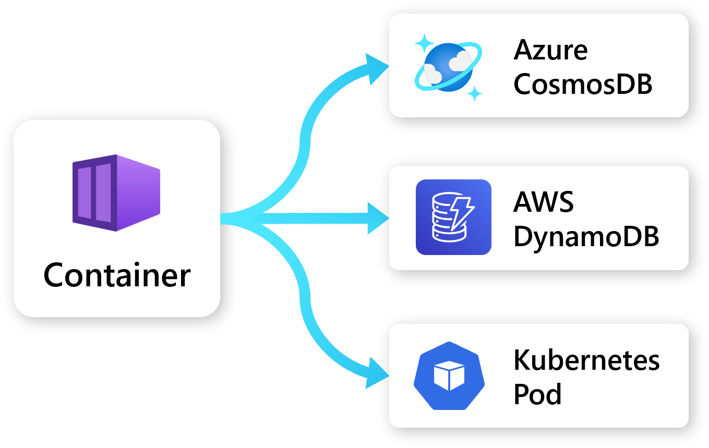

Radius makes it easy to model and connect to resources across popular platforms like Azure, AWS, and Kubernetes. This allows you to quickly define dependencies, add identity and access management roles, and even leverage platform features such as managed identities.

## Supported platforms
