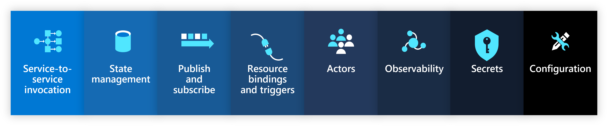

Project Radius offers first-class support for the [Dapr](https://dapr.io) runtime and building blocks to make it easy to make your code fully portable across code and infrastructure.

## Dapr sidecar

A Dapr sidecar allows your services to interact with Dapr building blocks. It is required if your service connects to a Dapr building block resource.

 

Easily add the Dapr sidecar to your [Containers]() using a Dapr sidecar extension:



{}

{}



Your container can now interact with the sidecar using the Dapr [building block APIs](https://docs.dapr.io/concepts/building-blocks-concept/) or the [Dapr SDKs](https://docs.dapr.io/developing-applications/sdks/).

## Dapr building blocks

Dapr links make it easy to model and configure [Dapr building block APIs](https://docs.dapr.io/developing-applications/building-blocks/) as resources. Simply specify the building block and the backing resource, and Radius will automatically configure and apply the accompanying Dapr configuration.

 

Model your building blocks as resources:









### Dapr component naming

To interact with a Dapr building block, you need to know the name of the [Dapr component](https://docs.dapr.io/concepts/components-concept/). This name is the same as the name of the building block resource.

For example, if you have a `Applications.Link/daprStateStores` resource named `mystatestore` the Dapr component name will be `mystatestore`. Your code will then interact with this component via `http://localhost:3500/v1.0/state/mystatestore`, or via the Dapr SDKs through the `mystatestore` component name.

Radius offers a [`componentName` property]() on all Dapr links to make it easy to access the Dapr `componentName` within your template. This makes it easy to update your Dapr links without needing to update your code. Instead, the name can be passed in as an environment variable.

{{< rad file="snippets/dapr-componentname.bicep" embed=true marker="//MARKER" replace-key-ss="//STATESTORE" replace-value-ss="resource statestore 'Applications.Link/daprStateStores@2022-03-15-privatepreview' = {...}" >}}

## Resource schema

Refer to the [schema reference docs]() for more information on how to model Dapr resources.
