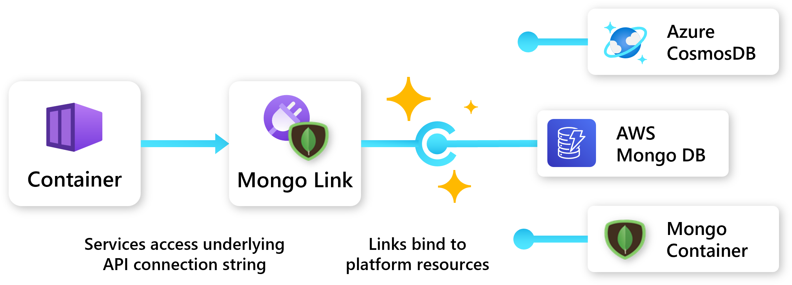

## Overview

Links provide **abstraction** and **portability** to Radius applications. This allows development teams to depend on high level resource types and APIs, and let infra teams swap out the underlying resource and configuration.

### Example

The following examples show how a [container]() can connect to a Redis link, which in turn binds to an Azure Cache for Redis or a Kubernetes Pod.




<h4>Underlying resource</h4>

In this example Redis is provided by a Kubernetes Pod:



<h4>Link</h4>

A Redis link can be configured with properties from the Kubernetes Pod:






<h4>Underlying resource</h4>

In this example Redis is provided by an Azure Cache for Redis:



<h4>Link</h4>

A Redis link can be configured with an Azure resource:







<h4>Container</h4>

A container can connect to the Redis link without any configuration or knowledge of the underlying resource:



## Link categories

Check out the Radius link resource schema docs to learn how to leverage links in your application:


