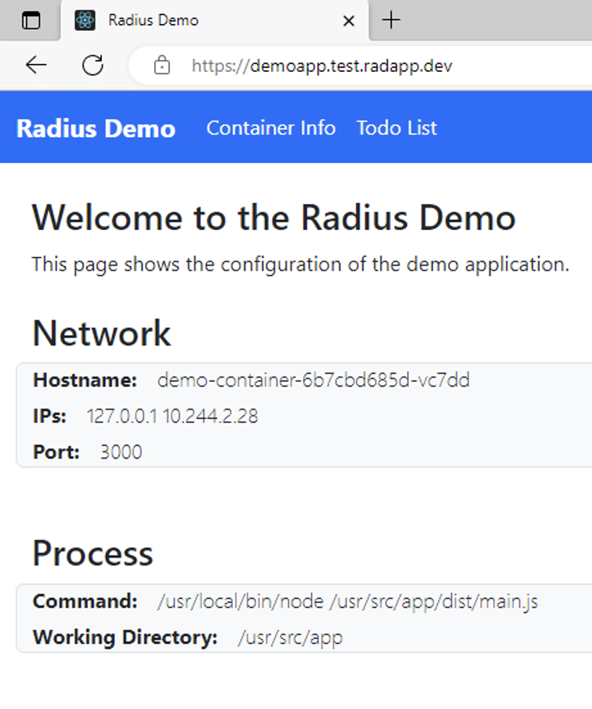

This guide will show you:

- How to model and use Secret Stores for a bring-your-own certificate scenario
- How to model and use Gateways for a Radius Gateway TLS termination scenario.

## Prerequisites

- [rad CLI]()
- [Supported Kubernetes cluster]()

## Step 1: Initialize a Radius environment

Begin by running `rad init` to initialize Radius and create an environment:

```sh
rad init
```

## Step 2: Define an Application, Secret Store, and Gateway

Begin by creating a file named `app.bicep`. You can either provide the certificate data directly in the Bicep file, or reference an existing Kubernetes secret with your certificate data.



{}



{}

{}



{}



## Step 3: Deploy the application

```sh
rad deploy app.bicep -p tlscrt=<base64-encoded TLS certificate> -p tlskey=<base64-encoded TLS certificate private key>
```

Once the deployment is complete, you should see a public endpoint displayed at the end. Navigating to this public endpoint should show you your application that is accessed via HTTPS, assuming that you have a valid TLS certificate.


