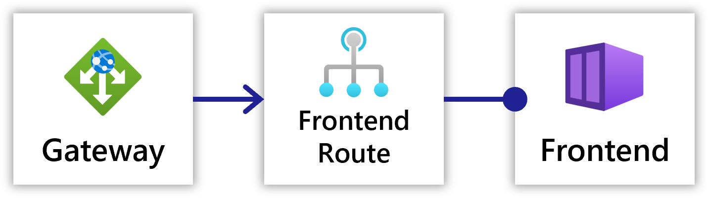

Radius networking resources allow you to model:

- Communication between a user and a service
- Communication between services

## DNS Service Discovery

`DNS Service Discovery`, or `DNS-SD`, is another way of defining HTTP communication between two [services](). It can define one-way and cycles of communication between services. `DNS-SD` differs from `HttpRoute` by not having to define an intermediary resource for connection.

 

A gateway can optionally be added for external users to access the service.

## HTTP Routes (advanced)

An `HttpRoute` resources defines HTTP communication between two [services](). They can be used to define both one-way communication, as well as cycles of communication between services.

 

Refer to the [HTTP Route schema]() for more information on how to model HTTP routes.

A gateway can optionally be added for external users to access the Route.

## Gateways

`Gateway` defines how requests are routed to different resources, and also provides the ability to expose traffic to the internet. Conceptually, gateways allow you to have a single point of entry for  traffic in your application, whether it be internal or external traffic.

`Gateway` in Radius are split into two main pieces; the `Gateway` resource itself, which defines which port and protocol to listen on, and Route(s) which define the rules for routing traffic to different resources. Both `DNS-SD` and `HttpRoute` are supported by `Gateway`.

 

Refer to the [Gateway schema]() for more information on how to model gateways.

### TLS Termination

Gateways support TLS termination. This allows incoming encrypted traffic to be decrypted with a user-specific certificate and then routed, unencrypted, to the specified routes. TLS certificates can be stored or referenced via a [Radius secret store]().

### SSL Passthrough

A gateway can be configured to passthrough encrypted SSL traffic to an HTTP route and container. This is useful for applications that already have SSL termination configured, and do not want to terminate SSL at the gateway.

To set up SSL passthrough, set `tls.sslPassthrough` to `true` on the gateway, and set a single route with no `path` defined (just `destination`).

## Example

### DNS-SD routing









### Path-based HTTP routing









### TLS termination









### SSL Passthrough








