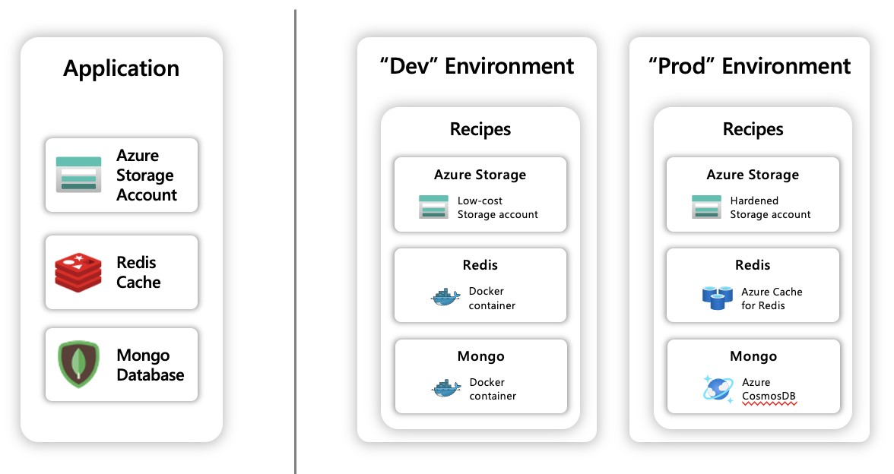

## Overview

Recipes enable a **separation of concerns** between infrastructure teams and developers by allowing for a **automated infrastructure deployment** that doesn't require developers to have infrastructure resource expertise. This abstraction is enabled by utilizing [Links]() as the connection to a Recipe.




## Recipe capabilities

### Select any Recipe connected to your Radius environment

When a Recipe is created it contains a unique **name** identifier that enables discovery and usability throughout your Radius environment.

```bicep
resource redis 'Applications.Link/redisCaches@2022-03-15-privatepreview'= {
  name: 'mylink'
  properties: {
    mode: 'recipe'
    recipe: {
      name: '<RECIPE-NAME-EXAMPLE>'
    }
  }
}
```
##### Identify all available  Recipes in your environment

List Recipes within an environment with [**rad recipe list**]()

### Customize Recipes with parameters

Authors of a Recipe can allow for resource configuration parameters inside of a Recipe which allows for user customizability when initializing a Link.

```bicep
resource redis 'Applications.Link/redisCaches@2022-03-15-privatepreview'= {
  name: 'mylink'
  properties: {
    mode: 'recipe'
    recipe: {
      name: 'prod'
      parameters: {
        location: 'global'
        minimumTlsVersion: '1.2'
      }
    }
  }
}
```

## Rad CLI commands

For a reference to all Recipe related CLI commands, please visit [**rad recipe**]().


## Authoring Recipes
{}
Recipes are a work-in-progress and currently only support [Redis Cache Links]()
{}


To learn more about how to create your own custom Recipe visit the administrative Recipe guide.


## Example

{}
Follow the administrative Recipe guide for information on how to add a Recipe to your Radius environment.
{}

<h4>Create a Redis Link</h4>

```bicep
resource redis 'Applications.Link/redisCaches@2022-03-15-privatepreview'= {
  name: 'mylink'
  properties: {
    mode: 'recipe'
    recipe: {
      name: 'prod'
      parameters: {
        location: 'global'
        minimumTlsVersion: '1.2'
      }
    }
  }
}
```
