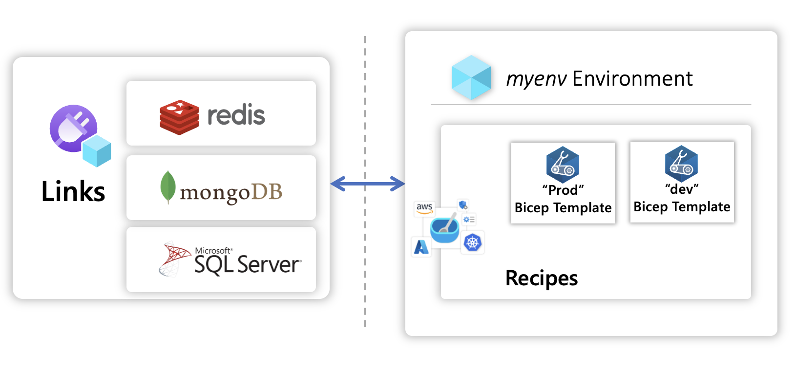

{}
Recipes are a work-in-progress, currently we support the following Links: [MongoDb](), [Redis]()
{}

## Overview

Recipes are templates stored in container registries that can be deployed by [Links]() once a Recipe has been registered in a Radius environment. Their purpose is to facilitate a **separation of concerns** between infrastructure teams and developers by allowing for a **automated infrastructure deployment** that doesn't require developers to pick up infrastructure resource expertise.




## Recipe features

| Feature | Description |
|---------|-------------|
| **Names** | Assign specific names to templates to enable discovery and usability throughout your Radius environment |
| **Default Recipes** *(coming soon)* | Define a default set of Recipes in order to enable usability without identification by developers.
| **Parameters** | Define parameters inside a Recipe for user customizability and pass in values either through your Radius environment or through individual Links.
| **Recipe Packs** *(coming soon)* | Create Recipes and organize them into groups of Recipe templates that can be consumed as individual groups.

## Rad CLI commands
| Command | Description |
|---------|-------------|
| [**rad recipe**]() | Manage link recipes Link recipes automate the deployment of infrastructure and configuration of links.
| [**rad recipe list**]() | List link recipes within an environment.
| [**rad recipe register**]() | Add a link recipe to an environment. You can specify parameters using the ‘–parameter’ flag (’-p’ for short).
| [**rad recipe unregister**]() | Unregister a link recipe from an environment.


### Authoring Recipes

To learn more about how to create your own custom Recipe visit the [administrative Recipe guide]


### Example

{}
Add a Recipe to your Radius environment by following the [administrative Recipe guide]
{}

<h4>Step 1: Create a Redis Link</h4>



<h4>Step 2: Deploy with `rad deploy`</h4>

```zsh
TODO
Deploy............
```

<h4>Step 3: Confirm containers have been deployed with `kubectl get pods`</h4>

```zsh
TODO
Kube
```

## Additional guides

For more information refer to the [Recipe quickstart]

