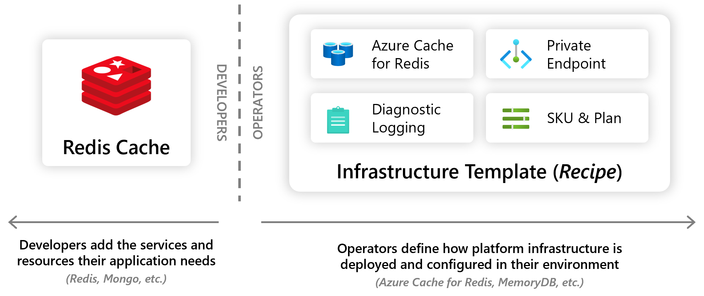

## Overview

Recipes enable a **separation of concerns** between infrastructure operators and developers by **automating infrastructure deployment**. Developers select the resource they want in their app (_Mongo Database, Redis Cache, Dapr State Store, etc._), and infrastructure operators codify in their environment how these resources should be deployed and configured (_lightweight containers, Azure resources, AWS resources, etc._). When a developer deploys their application and its resources, Recipes automatically deploy the backing infrastructure and bind it to the developer's resources.

## Capabilities

### Select the Recipe that meets your needs

Recipes can be used in any environment, from dev to prod. You can run a default recipe registered in your environment or select the specific Recipe you want to run. To run a default recipe, simply add the resource you want to your app and omit the Recipe name:

 

If you want to use a specific Recipe, you can specify the Recipe name in the `recipe` parameter:



Use [**rad recipe list**]() to view the Recipes available to you in your environment.

### Use lightweight "local-dev" Recipes

Radius environments make it easy to get up and running with Recipes instantly. When you run [`rad init`]() you get a set of containerized local-dev Recipes pre-registered in your environment. These Recipes are designed to help you get started quickly with Recipes using lightweight containers. You can use these Recipes to test your app locally, or deploy them to a dev environment.

### Customize with parameters

Recipes can be customized with parameters, allowing developers to fine-tune infrastructure to meet their specific needs:



You can use [**rad recipe show**]() to view the parameters available to you in a Recipe.

### Author custom Recipes

It's easy to author and register your own Recipes which define how to deploy and configure infrastructure that meets your organization's needs. See the [custom Recipes guide]() for more information.

## Supported resources

Recipes currently support the following resources. Support for additional resources is actively being worked on.

| Supported resources | 
|---------------------|
| [`Applications.Link/redisCaches`]() | 
| [`Applications.Link/mongoDatabases`]() |
| [`Applications.Link/sqlDatabase`]() | 
| [`Applications.Link/rabbitmqMessageQueues`]() |
| [`Applications.Link/daprStateStores`]() |
| [`Applications.Link/daprPubSubBrokers`]() |
| [`Applications.Link/daprSecretStore`]() |
| [`Applications.Link/extenders`]() |

## Infrastructure linking

When you use a Recipe to deploy infrastructure (_e.g. Azure, AWS resources_), that infrastructure can be linked and tracked as part of the Recipe-enabled resource. This means you can inspect what infrastructure supports the resource. Use [`rad resource show -o json`]() to view this information.

## Infrastructure lifecycle

The lifecycle of Recipe infrastructure is tied to the resource calling the Recipe. When a Recipe-supported resource is deployed it triggers the Recipe, which in turn deploys the underlying infrastructure. When the Recipe-supported resource is deleted the underlying infrastructure is deleted as well.

## Further Reading

- [Author custom recipes]()
- [`rad recipe` CLI reference]()
