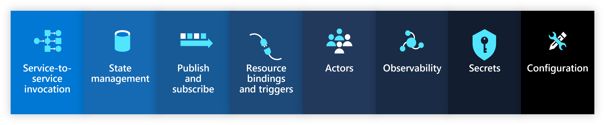

Project Radius offers first-class support for the [Dapr](https://dapr.io) runtime and building blocks to make it easy to make your code fully portable across code and infrastructure.

## Dapr sidecar

A Dapr sidecar allows your services to interact with Dapr building blocks. It is required if your service connects to a Dapr building block resource.

 

Easily add the Dapr sidecar to your [Containers]() using a Dapr sidecar trait:



{}

{}



## Dapr building blocks

Dapr connectors make it easy to model and configure [Dapr building blocks](https://docs.dapr.io/developing-applications/building-blocks/) as resources. Simply specify the building block and the backing resource, and Radius will automatically configure and apply the accompanying Dapr configuration.

 

Model your building blocks as resources:



{}

{}



## Resource schema

Refer to the [connector reference docs]() for more information on how to model Dapr resources via Radius connectors.
