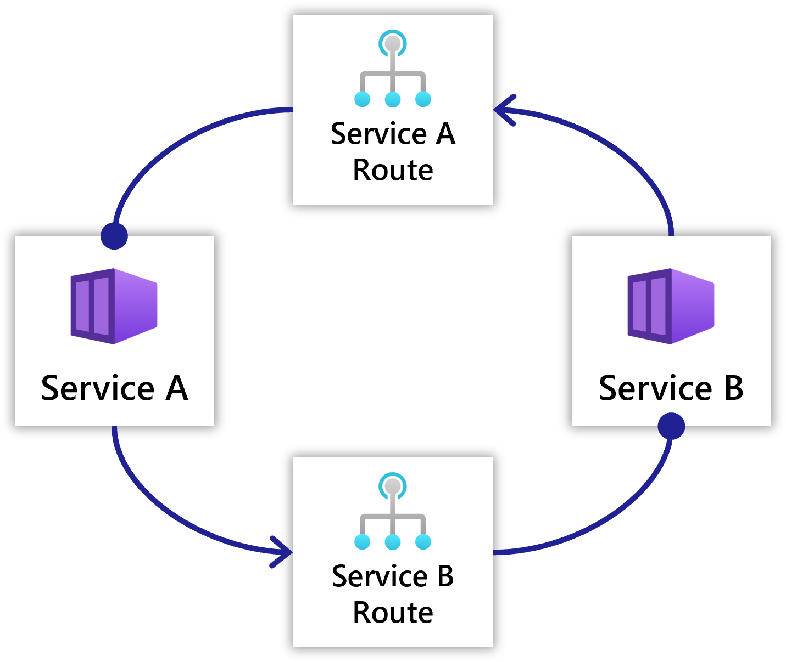
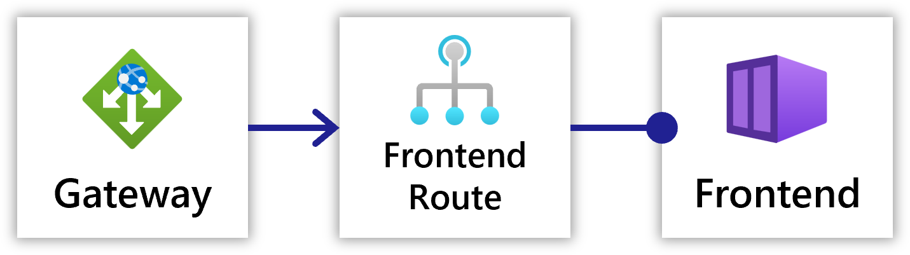

Radius networking resources allow you to model:

- Communication between a user and a service
- Communication between services

## HTTP Routes

An `HttpRoute` resources defines HTTP communication between two [services](). They can be used to define both one-way communication, as well as cycles of communication between services.

 

Refer to the [HTTP Route schema]() for more information on how to model HTTP routes.

A gateway can optionally be added for external users to access the Route.

## Gateways

`Gateway` defines how requests are routed to different resources, and also provides the ability to expose traffic to the internet. Conceptually, gateways allow you to have a single point of entry for  traffic in your application, whether it be internal or external traffic.

`Gateway` in Radius are split into two main pieces; the `Gateway` resource itself, which defines which port and protocol to listen on, and Route(s) which define the rules for routing traffic to different resources.

 

Refer to the [Gateway schema]() for more information on how to model gateways.

## Example



{}

{}


