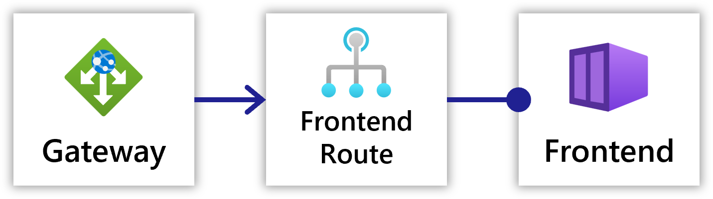

## Overview

`Gateway` defines how requests are routed to different resources and provides the ability to expose traffic to the internet. Conceptually, gateways allow you to have a single point of entry for traffic in your application, whether it be internal or external traffic.

A `Gateway` in Radius is split into two main pieces:
1. the `Gateway` resource itself, which defines which port and protocol to listen on 
2. Route(s) which define the rules for routing traffic to different resources

 

## Resource format



The following top-level information is available:

| Key  | Required | Description | Example |
|------|:--------:|-------------|---------|
| name | y | The name of your Gateway. | `'gateway'`

### Properties

| Key  | Required | Description | Example |
|------|:--------:|-------------|---------|
| hostname | n | The hostname information for this gateway. | [See below](#hostname)
| routes | y | The routes attached to this gateway. | [See below](#routes)

#### Routes

You can define a list of routes, each representing a connection to a service. Specifying a route opens the destination [HTTP Route]() to the internet.

| Key  | Required | Description | Example |
|------|:--------:|-------------|---------|
| path | y | The path to match the incoming request path on. | `'/service'`
| destination | y | The [HttpRoute]() to direct traffic to when the path is matched. | `route.id`

#### Hostname

You can define hostname information for how to access your application. See [below](#hostname-generation) for more information.

| Key  | Required | Description | Example |
|------|:--------:|-------------|---------|
| prefix | n | A custom DNS prefix for the generated hostname. | `'prefix'`
| fullyQualifiedHostname | n | A fully-qualified domain name to use for the gateway. | `'myapp.mydomain.com'`

## Hostname Generation

There are three options for defining hostnames:

1. Omit the `hostname` property, and Radius will generate the hostname for you with the format: `gatewayname.appname.PUBLIC_HOSTNAME_OR_IP.nip.io`.
1. Declare `hostname.prefix`, and Radius will generate the hostname based on your chosen prefix: `prefix.appname.PUBLIC_HOSTNAME_OR_IP.nip.io`.
1. Declare `hostname.fullyQualifiedHostname`, and Radius will use your fully-qualified domain name as the hostname: `myapp.mydomain.com`. Note that you must map the public IP of the platform your app is running on to the chosen hostname. If you provide this property as well as `prefix`, this property will take precedence.
