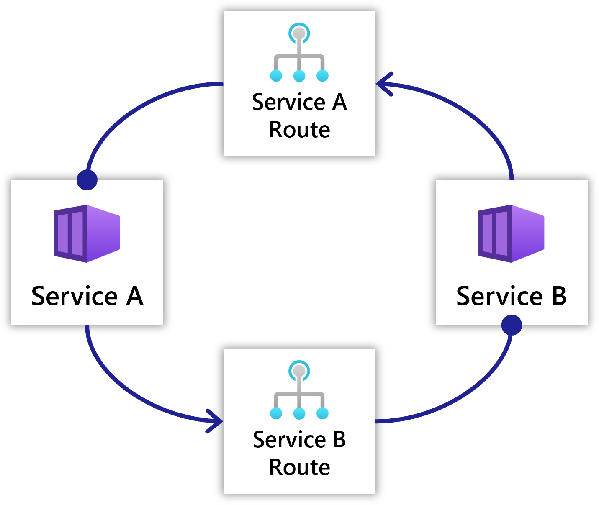

## Overview

An `HttpRoute` resources defines HTTP communication between two services. They can be used to define both one-way communication and cycles of communication between services.

 

A gateway can optionally be added for external users to access the Route.

## Resource format



The following top-level information is available:

| Key  | Required | Description | Example |
|------|:--------:|-------------|---------|
| name | y | The name of your HttpRoute. Used to provide status and visualize the resource. | `'web'`

## Provided Data

The following data is available for use from the consuming service:

### Properties

| Property | Description | Example |
|----------|-------------|-------------|
| host | The hostname of the HTTP endpoint | `example.com` |
| port | The port of the HTTP endpoint | `80` |
| scheme | The scheme of the HTTP endpoint | `http` |
| url | The full URL of the HTTP endpoint | `http://example.com:80` |

## Service compatibility

| Service | Azure | Kubernetes |
|-----------|:-----:|:----------:|
| [`Container`]() | ✅ | ✅ |

## Example

The following example shows two containers, one providing an HttpRoute and the other consuming it:

### Providing container

Once an HttpRoute is defined, you can provide it from a [container]() by using the `provides` property:



### Consuming container

To consume an HttpRoute, you can use the `connections` property:


