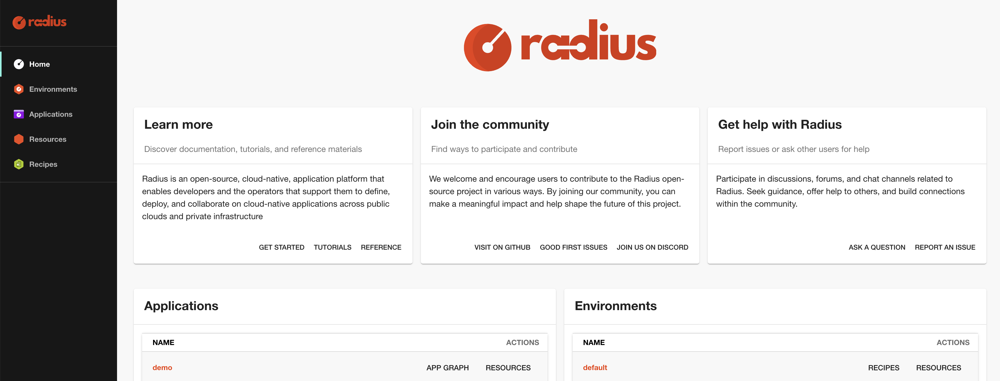

## Introduction

Radius is a platform for defining and deploying applications and infrastructure to any cloud. It is a central component of modern-day internal developer platforms (IDPs). It allows platform engineers to define resource types for developers to use when building their applications, and separately, the implementation of those resource types using existing Infrastructure as Code (IaC) templates and modules. Additionally, Radius enables platform engineers to define logical environments with specific deployment targets (e.g., a specific cloud provider region), each with their own IaC implementation.

This page provides a conceptual overview of Radius. It describes Radius' logical components, technical architecture, and how Radius relates to other IDP components. It is accompanied by additional concept pages focused on each of the core components: Resource Types, Recipe Packs, Environments, and Applications. If you are new to Radius, you are encouraged to complete the [Getting Started guide]() before or after reading these concept pages.

## IDP reference architecture

The reference architecture below separates resource *definition* from resource *deployment*. For example, rather than an *Azure Database for PostgreSQL Flexible Server* resource that is obviously only deployable to Azure, the resource definition is an abstract PostgreSQL database resource type. A swappable resource deployment IaC implementation is then used when actually deploying this database to Azure.

By separating resource definition from resource deployment, platform engineers are able to:

- Cleanly separate the work of developers building applications from platform engineers building infrastructure
- Improve the application developer experience by defining resource types that are just the right level of abstraction for applications
- Eliminate the need for developers to handle low-level infrastructure details
- Ensure portability between cloud providers and container platforms
- Ensure best practices for infrastructure security, operational, and cost are followed by default



The reference architecture also highlights many of the integrations Radius has with other common IDP components. Resource deployments are done with Terraform or Bicep today, with other IaC tools planned for the future. Deploying via CI/CD pipelines is fully via Flux with ArgoCD planned for the future. And the Radius developer portal is built using Backstage.

## Logical architecture

Radius is designed around a small number of core components. In order to enforce the separation of resource definition from resource deployment, each component is typically owned by either a platform engineer or a developer.



### Platform engineer components

#### Resource Types

Resource Types define the abstraction for a resource that will exist in the real world when deployed. Resource Types represent the **interface**, or contract, between developers and the platform. Since they are abstract and application oriented, there is only one Resource Type defined within Radius for each application resource. For example, a platform engineer may define a PostgreSQL database Resource Type which is an application-oriented abstraction of one of the many ways of deploying a PostgreSQL database. Resource Types are defined conceptually by what they represent, but concretely by their name, API version, and their schema. The schema contains the set of required and optional properties which are used by developers when defining their application.

#### Recipe Packs

While Resource Types define the interface, Recipe Packs define the resource deployment **implementation**. A Recipe Pack is a simple manifest whose primary property is a set of recipes, one for each Resource Type. The term *recipe* is used as a generic term to refer to both a Terraform configuration or a Bicep template. For each Resource Type, the Recipe Pack specifies the Terraform configuration or Bicep template used to deploy that type, along with recipe parameter values that Radius will pass to the recipe at deploy-time. One or more Recipe Packs are then referenced in an Environment definition.

Recipes are not tightly coupled with Radius or the Resource Type. In most circumstances, an existing Terraform configuration or Bicep template can be used as a recipe with slight modifications to ensure the properties in the Resource Type map to the Terraform variables or Bicep parameters. Off-the-shelf community modules can also be used directly as recipes without modification.

#### Environments

Environments are where Resource Types, Recipe Packs, and cloud providers come together. An Environment defines where applications are deployed; i.e., a landing zone for applications. Specifically, a Kubernetes namespace, an AWS account, region, and EKS cluster, or an Azure subscription, resource group, and AKS cluster. The Kubernetes cluster where the Radius control plane runs is independent of where application containers are deployed, so a single Radius installation can deploy applications to many different clusters. Critically, the Environment also defines which Recipe Packs are used to deploy resources. By assigning Recipe Packs at the Environment level, it is possible for each Environment to have a unique set of recipes.

Finally, within the Environment definition, Environment-level recipe parameters can be defined. Recipe parameters are useful for injecting additional environmental information into the recipe such as if the environment is production or non-production. These parameters will override parameters defined within the Recipe Pack.

#### Resource Groups

All resources are created in one and only one Resource Group. They are analogous to a Kubernetes Namespace or an Azure Resource Group.

#### Credentials

When a developer requests a resource to be deployed, those resources are not deployed using the developers' credentials. Rather, Radius uses its own Kubernetes, AWS, or Azure credentials stored in the Radius control plane. This enables platform engineers to only allow resources to be deployed via Radius.

### Developer components

#### Applications and resources

Developers build applications. But when they deploy those applications to Kubernetes or other container platforms, the notion of an application is typically lost. Developers are left with essentially a flat list of resources. In the best case, the resources are annotated with the application name, but not always. This makes it challenging for developers and SREs to understand what resources belong to what applications.

Radius takes a different approach and makes the application a first-class resource. With Radius, developers first define an Application resource, then add resources to that Application such as containers and databases. All resources belong to an Application (with some exceptions for resources shared across applications such as shared storage). When an Application is deployed to an Environment, the Application's abstract resource definitions are *implemented* by the platform-specific recipes in the Recipe Packs assigned to the Environment.

## Technical architecture

The diagram below visualizes the technical components that are created when you install Radius on a Kubernetes cluster.



### Radius CLI

The Radius CLI, `rad`, is the primary means of interacting with Radius for both developers and platform engineers. The Radius CLI uses the current Kubernetes context in `~/.kube/config` to determine which Radius control plane to communicate with. Additionally, the Radius CLI will read the user's current Workspace, which defines the current Resource Group and Environment, from the `~/.rad/config.yaml`file. 

### Dashboard

When defining an application, developers use the [Backstage](https://backstage.io/)-based Dashboard to reference organization-specific documentation, see what Resource Types are available, and get a list of Environments they can deploy their application to. After applications have been deployed, the Dashboard gives developers and SREs the list of deployed applications and resources. The Dashboard also makes it easy to visualize deployed applications in an application, or dependency, graph.

### Universal Control Plane

The Universal Control Plane (UCP) is the Radius control plane. It provides a REST API for creating, reading, updating, deleting, and listing resources. When a platform engineer creates a new Resource Type, the UCP API is being extended since each Resource Type has its own API.

UCP is exposed using the Kubernetes API Server via the [Kubernetes API Aggregation Layer](https://kubernetes.io/docs/concepts/extend-kubernetes/api-extension/apiserver-aggregation/), meaning the Radius control plane endpoint is actually the Kubernetes API Server endpoint. This also means that controlling access to the Radius API is achieved using Kubernetes RBAC.

### Deployment Engine

When an Application is deployed using Radius, UCP makes a request to the Deployment Engine.  Deployment Engine examines the resources in the application definition and calculates the dependencies. For example, if an application definition has a frontend container, a database, and a secret to store the database credentials, Deployment Engine will determine that the secret must be deployed first, then the database which requires the secret value, and finally the frontend container which requires the database hostname and credentials.

### Applications and Dynamic Resource Providers

The Applications and Dynamic Resource Provider (RP) components are internal components that handle the actual deployment of resources. Ultimately, the Terraform or Bicep CLIs are executed within the Applications RP container.

### Controller

The Controller component is an internal component that handles miscellaneous functions such as the integration with Flux CI/CD.

### Git repository and OCI registry

When Radius deploys a resource using Terraform or Bicep, the Applications and Dynamic RP container must have access to the specified recipe. Therefore, a Git repository is used to store Terraform configurations and an OCI registry is used to store Bicep templates. Radius does not run recipes off the local workstation's file system.

## Organization

The concept documentation is organized into four sequential pages, each covering one of the core Radius components: Resource Types, Recipe Packs, Environments, and Applications. Read them in order for a complete conceptual overview. If you prefer to be hands-on, skip forward to the [Getting Started guide]().

