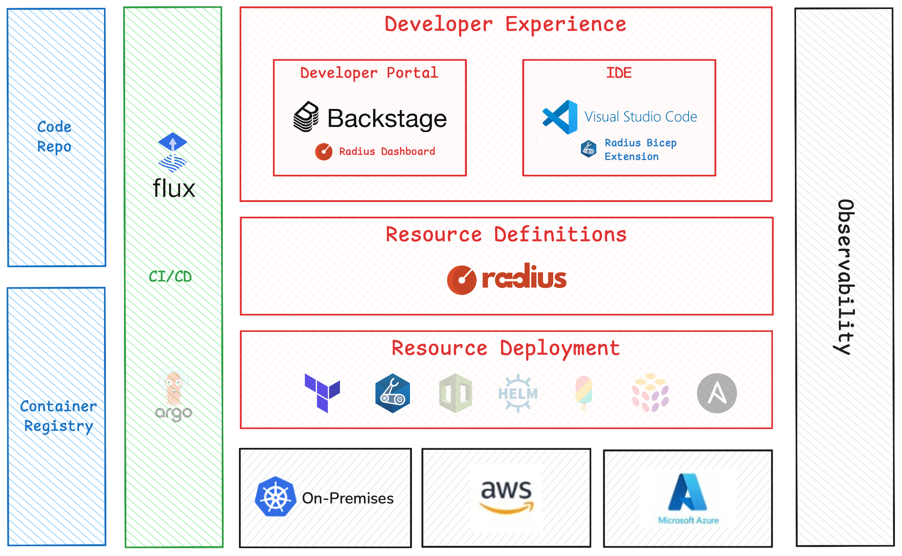
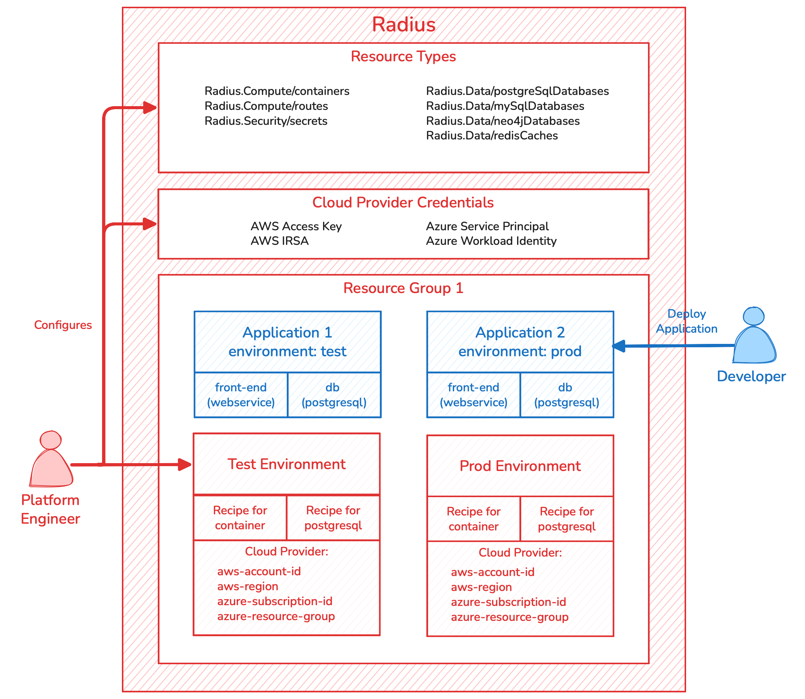
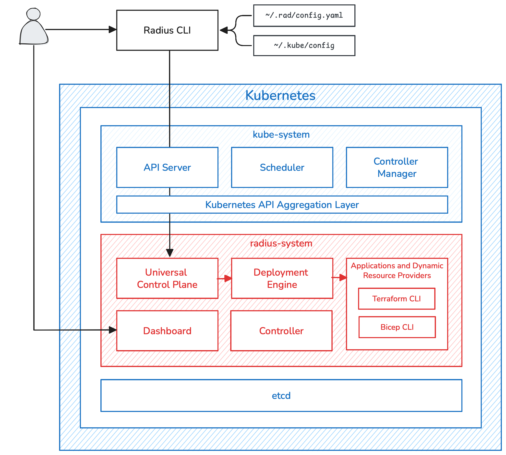

## Introduction

Radius is a platform for managing application resources deployed to the cloud. It is a central component of modern day internal developer platforms (IDPs) and allows platform engineers to define resource types for developers to use when building their applications, and separately, the implementation of those resource types using existing Infrastructure as Code (IaC) templates and modules. Additionally, Radius enables platform engineers to define logical environments with specific deployment targets (e.g., a specific cloud provider region), each with their own IaC implementation. 

This page is a conceptual overview of Radius. It describes how Radius integrates with other IDPs, its logical components, and the technical architecture. It is accompanied by additional concept pages focused on each of the core components including Resource Types, Recipes, Environments, and Applications. If you are new to Radius, you are encouraged to complete the [Quick Start](). After reading the concept documentation, complete the end-to-end [tutorial]().

## Radius and Internal Developer Platforms

Radius is designed to integrate with other common tools to build an end-to-end IDP for developers. The diagram below is a reference architecture for an IDP that uses Radius.

### Developer Experience

When defining these resources, developers can leverage the Radius Dashboard and VS Code IDE integration the Radius Bicep extension.

#### Developer Dashboard

The Radius Dashboard is a developer portal built using Backstage. Its primary purpose is to provide developers with organization-specific developer documentation. As you can see in the screenshot below, the Dashboard includes details for developers on what Resource Types are available for use within their application, as well as a list of Environments they can deploy their application to.

Platform engineers can write developer documentation for each Resource Type. In the screenshot below, the Overview tab has instructions on how and when to use the Resource Type as well as examples. Other common uses for the Overview is to include a point of contact for help or who the original author of the Resource Type was. 

The Properties tab are the available properties a developer can set when defining their application resources. Finally, Output Properties are read-only properties on the Resource Type which developers can use either in their application definitions or via environment variables in their containers.

#### IDE Integration

Radius integrates with VS Code to provide developers with syntax highlighting and autocomplete. Radius creates a Bicep extension for each Radius Resource Type. Developers can then install the Bicep extension for VS Code and get the full integrated experience.

### Resource Definitions

Developers today are burdened with having to understand not only their users' needs, their application's codebase, and their programming language and libraries, but also details about the underlying cloud infrastructure. Developers are often tasked with writing low-level IaC code. For example, they may author a Helm chart to deploy their containers to Kubernetes and, separately, a CloudFormation template to deploy an AWS RDS database. Radius completely abstracts the infrastructure away from developers. Rather than writing IaC code, developers using Radius define application resources using high-level, application-centric resource definitions. 

This reference architecture, and Radius, draws a strong distinction between resource definition, and resource deployment. The common software engineering concept of separating the *interface* from the *implementation* is applied to resource management with Radius. 

In Radius, the interface is the **Resource Type**. Platform engineers can use the Resource Type which ship with Radius, community contributed Resource Types in the `resource-type-contrib` repository, or define their own from scratch. Resource Types are the contract between the developers and the platform. Each Resource Type has a set of properties which developers set when describing their application in an application definition file. 

By separating resource definition from resource deployment, platform engineers are able to:

* Enforce separation of concerns between application developers and platform engineers
* Define resource types which are higher level and more application oriented 
* Eliminate the need for developers to handle low-level infrastructure details
* Ensure portability between cloud providers and container platforms
* Enforce infrastructure security, operational, and cost best practices 

### Resource Deployment 

Resource deployment, the *implementation*, leverages existing IaC solutions. Today, Radius can use existing Terraform modules or Bicep templates with minimal changes to deploy resources. Radius uses the term **Recipe** as a generic term for a Terraform module or Bicep template. In the fullness of time, Radius will support multiple IaC solutions based on user demand.

### Cloud Platforms

Because applications defined using Radius do not have infrastructure details in their definitions, platform engineers can define the deployment target without affecting developers. In Radius, this deployment target is referred to as an **Environment**. Radius can deploy any resource to any platform that has a Terraform provider or Bicep extension. Out of the box, Radius explicitly supports:

**Container Compute Platforms**

* Kubernetes
* Azure Container Instances

**Cloud Services**

* Any AWS service
* Any Azure service

Resources can be deployed to other platforms, however, platform engineers will need to manually manage the deployment targets and credentials. 

## Logical Architecture

Radius is designed around a small number of core components. In order to enforce the separation of concerns discussed earlier, each entity is managed by either a platform engineer, or a developer, but never both.

### Platform Engineer Components

#### Resource Groups

All resources are created in one and only one Resource Group. They are analogous to a Kubernetes Namespace or an Azure Resource Group.

#### Resource Types

As introduced earlier, Resource Types model the contract between developers and the platform. They define the interface that developers have with the platform, and therefore define the resources and the required and optional properties when creating a resource. Resource Types are described in depth in the subsequent Resource Types concept page, but it is important to understand that there is a single Radius Resource Type for each resource type in the real world. For example, while Radius may by able to deploy a PostgreSQL database to Kubernetes, AWS, and Azure, there is only one Resource Type defined within Radius.

Resource Types are discussed in detail in the Resource Types concept page.

#### Recipes

While resource types define the interface, or abstraction, Recipes define the implementation for a resource type. A recipe can be an existing Terraform module stored in a Git repository or a Bicep template stored in an OCI registry. For each resource type, there may be multiple recipes. For example, a PostgreSQL resource type may have:

1. A recipe for local development which deploys to Kubernetes
2. A recipe for the test environment which deploys to Kubernetes with more resources
3. A recipe for the staging environment that deploys to AWS using AWS RDS
4. A recipe for the production environment that deploys to AWS using AWS RDS with high availability and backups configured

Multiple recipes is not required. In the example above, the recipe #1 and #2 could be combined into an enhanced recipe which has an conditional on the environment name; e.g., if the environment name is `test` then set the CPU resource requests to 2, else do not set the CPU resource request.

Other examples and how the recipe knows what environment it is using is discussed in the Recipes concept page. 

#### Environments

An Environment is a composed of two things: 

1. The target deployment destination such as what cloud provider and what region
2. The set of Recipes to use to deploy to that target

Environments are also used to configure deployment-time settings for Terraform and Bicep. This is discussed in the Environments concept page.

### Developer Components

#### Applications and Resources

Developers build cloud-native applications, but when they deploy those applications to Kubernetes or other container platforms, the notion of an application of typically lost amongst the sea of resources that are deployed to run the application. This makes it challenging manage because developers and SREs are presented with a flat list of resources. Maybe the resources are annotated with the application name, but maybe not.

Radius takes a different approach and makes the application a first-class resource. With Radius, developers first define their application, then add resources to that application such as containers and databases. All resources belong to an Application (with some exceptions for resources shared across applications such as shared storage). 

When an Application is deployed to an Environment, the Application's abstract resource definitions are married with the Environment's cloud-specific Recipes. 

## Technical Architecture

Radius is deployed on Kubernetes. It integrates with the Kubernetes API Server via the [Kubernetes API Aggregation Layer](https://kubernetes.io/docs/concepts/extend-kubernetes/api-extension/apiserver-aggregation/) meaning the Radius control plane endpoint is actually the Kubernetes API Server endpoint. This also means that controlling access to the Radius API is achieved using Kubernetes RBAC.

### Radius CLI

The Radius CLI, `rad`, is the primary means of interacting with Radius (the Dashboard is read only). The Radius CLI uses the current Kubernetes context in `~/.kube/config` to determine which Radius control plane to communicate with. Additionally, the Radius CLI will read the user's current Workspace which defines the current Resource Group and Environment from the `~/.rad/config.yaml`file. 

### Dashboard

The Radius Dashboard is a Backstage-based developer portal which shows the available Resource Types and Environments, along with developer documentation for each Resource Type. Applications and resources can also be viewed. Note that the default Radius installation creates a Dashboard Kubernetes Service of type `ClusterIP`. It is left to the platform engineer to configure ingress to the Dashboard.

### Universal Control Plane

The Universal Control Plane (UCP) is the Radius control plane. It provides a REST API for creating, reading, updating, deleting, and listing resources. When a platform engineer creates a new Resource Type, the UCP API is being extended since each Resource Type has its own API.

### Deployment Engine

When an application is deployed using Radius, UCP makes a request to the Deployment Engine.  Deployment Engine examines the resources in the application definition and calculates the dependencies. For example, if an application definition has a frontend container, a database, and a secret for the database credentials, Deployment Engine will determine that the secret must be deployed first, then the database which requires the secret value, then the frontend contain which requires the database hostname and credentials.

### Applications and Dynamic Resource Providers

The Applications and Dynamic Resource Provider components are internal components that handle the actual deployment of resources. Ultimately, the Terraform or Bicep CLIs are executed within the Dy

### Controller

The Controller component is an internal component that handles miscellaneous functions such as the integration with Flux CI/CD.
