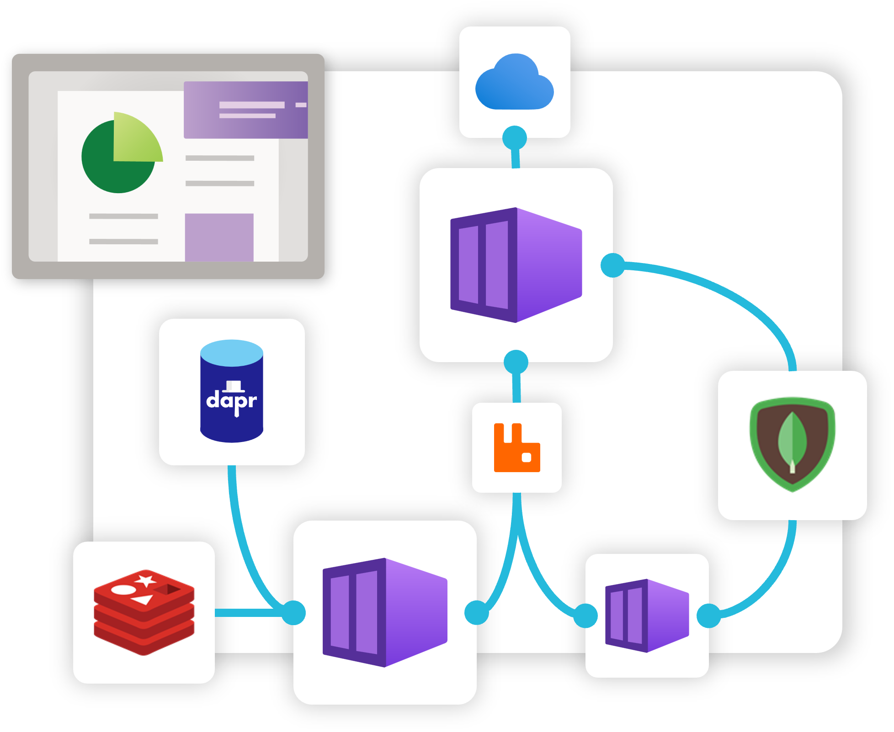
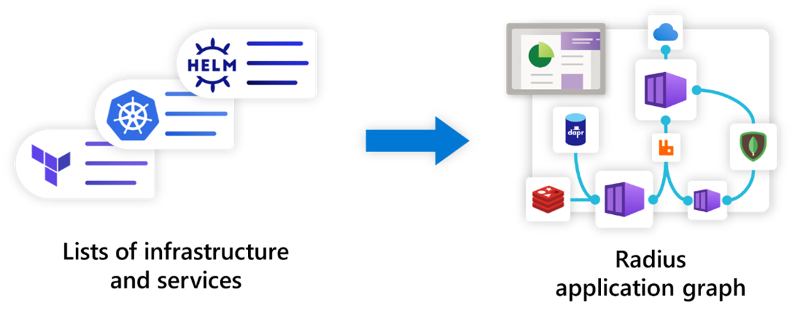
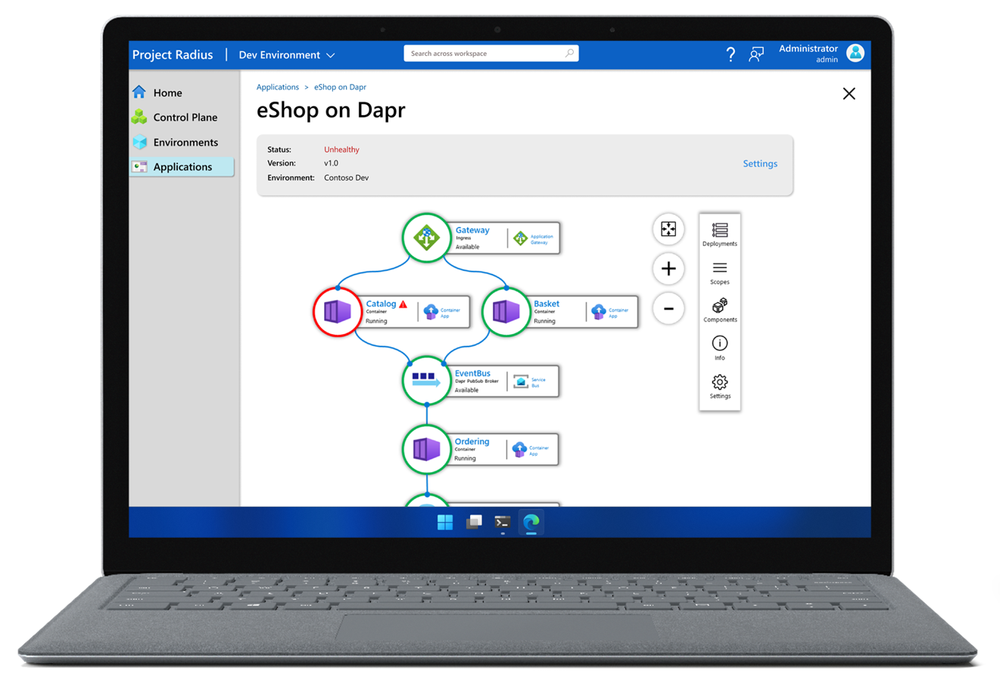

## Radius Applications

Radius offers an [application resource]() which teams can use to define and deploy their entire application, including all of the compute, relationships, and infrastructure that make up the application. Since the graph of relationships between deployed resources is much more descriptive than a basic list of resources, the Radius Application graph can automate complex deployment tasks and enable rich visualization experiences.



## Graphs are better than lists

Within an application deployed with Radius, developers can express both the resources (_containers, databases, message queues, etc._), as well as all the relationships between them. This forms the Radius Application graph. This graph is powerful because it allows Radius to understand the relationships between resources, simplifying the [deployment]() and [configuration]() of your application. Plus, it allows you to visualize your application in a way that is more intuitive than a list of resources.



## Self-documenting applications

The Radius Application graph also allows your application to be self-documenting, where developers and operators can query and reason about the same application definition. Instead of multiple views of logs, infrastructure, and code, Radius provides a single source of truth for your application.



> **Note:** A Radius dashboard is still on the roadmap, but in the meantime you can use the [Radius API]() to build your own visual experiences today.

## Mine the app graph API

The Radius Application graph is also exposed as an API, allowing you to build your own visualizations, workflows, and more on top of Radius. Learn more in the [API docs]().

For example, I can get the status of my `frontend` container, and get its definition and its connections to other resources:

```bash
GET /planes/radius/local/resourceGroups/default/providers/Applications.Core/containers/frontend
```

```
{
  "name": "frontend",
  "type": "Applications.Core/containers"
  "id": "/planes/radius/local/resourceGroups/default/providers/Applications.Core/containers/frontend",
  "properties": {
    "container": {
      "image": "nginx:latest",
      "env": {...},
      "ports": {...},
    },
    "environment": "myenvironment",
    "application": "myapp"
  },
  "connections": {
      "backend": {
        "source": "/planes/radius/local/resourceGroups/default/providers/Applications.Core/containers/backend",
      },
      "storage": {
        "source": "/planes/azure/subscriptions/ee3dbd5a-68b4-4eea-bc48-f064009e6ff9/resourceGroups/myrg/providers/Microsoft.Storage/storageAccounts/mystorage",
        "iam": {
          "kind": "azure",
          "roles": [
            "Storage Blob Data Reader"
          ]
        }
      }
    },
}
```

## Next step

Now that you have an understanding of the Radius app graph, learn how you can deploy Radius applications to prepared landing zones with Radius Environments:


