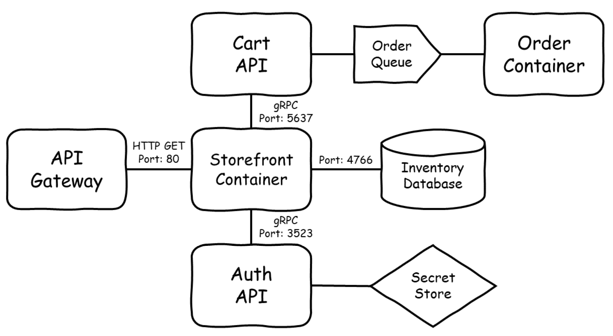
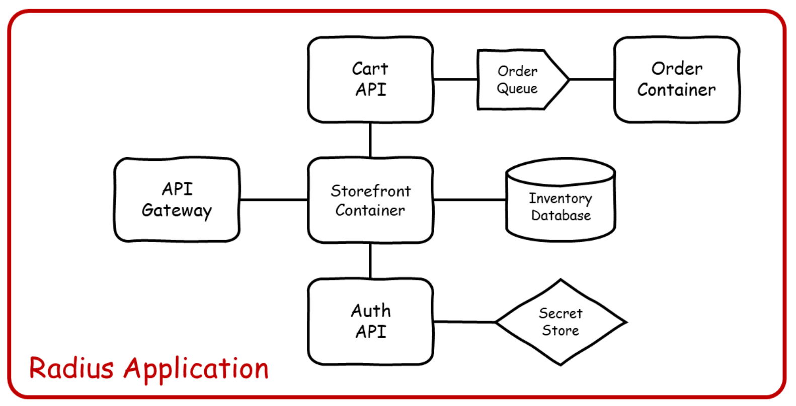
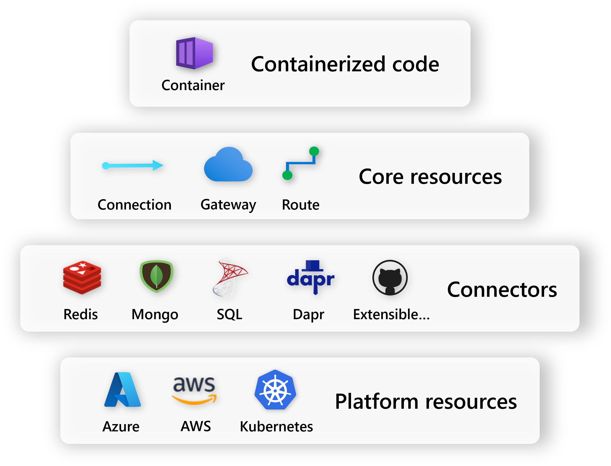

## Deployable architecture diagrams

Cloud-native applications are often designed and described using lines-and-boxes architecture diagrams as the starting point:

 

These diagrams often include:

1. Infrastructure resources, including databases, messages queues, API gateways, and secret stores
1. Services that run application code, such as containers.
1. Relationships between resources, like protocols, settings, and permissions

The Radius app model provides a way for developers to translate human-understandable application diagrams into human-understandable application code.

## Defining an Application

The Radius application contains everything on an app diagram. That includes all the compute, data, and infrastructure.

{}
The largest circle you can draw around your resources where names have meaning.
{}

 

An application is defined as a top-level `resource app` in an infrastructure-as-code file:









## Adding resources

Currently, this example app is an empty shell and has no child resources defined. It's up to the user to define what they consider part of the app. Users can include both services (containers) and infrastructure resources (databases, caches, etc.).

 

Each node of an architecture diagram maps to one resource. Together, an application's resources capture all of the important behaviors and requirements needed for a runtime to host that app.

Updating our IaC file, this would look like:









## Adding connections

Once you define your application and the resources inside of it, you can define the connections between them. Connections are defined as:

{}
A **logical** unit of communication between resources.
{}

The use cases for connections are flexible, and include features like: 

- Configuring role based access control (RBAC) between resources
- Passing resource information like connection strings, credentials, etc. to the consumer of a resource
- Configuring security policies between resources and runtimes

### Injected values

Declaring a connection between two resources also injects information in the form of environment variables based on the name of the connection and its kind. This is a form of *cloud-native service discovery* and makes it easy for you to decouple your application code from the environment where its deployed.

These environment variables follow a naming convention that makes their use predictable. The naming pattern includes the connection name, which is part of the consuming component. This way the code that needs to read the values gets to define how they are named.

Each kind of connection defines values that are useful for communication. These could be URIs, connection strings, access keys, or anything that application code needs to successfully communicate. Refer to each [resource's reference documentation]() for more information.

The values provided through connections are a convenience and are also available as properties and functions (for secrets) when authoring your IaC files. You can ignore the values generated by a connection if you prefer to be explicit, or if you already have a convention you like to follow.

Adding connections to the above IaC file, it becomes:









## Next step

Now that you have an understanding of the Radius app model, learn more about the Radius environment:


