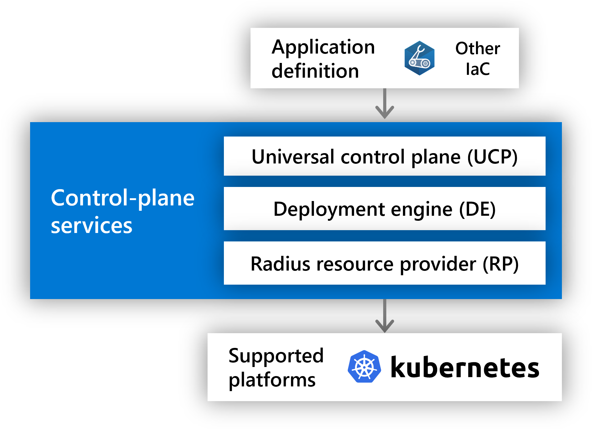
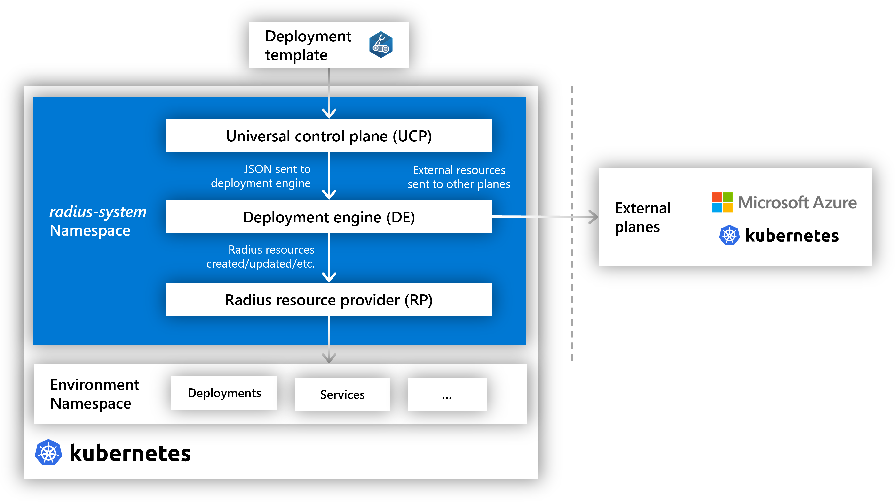
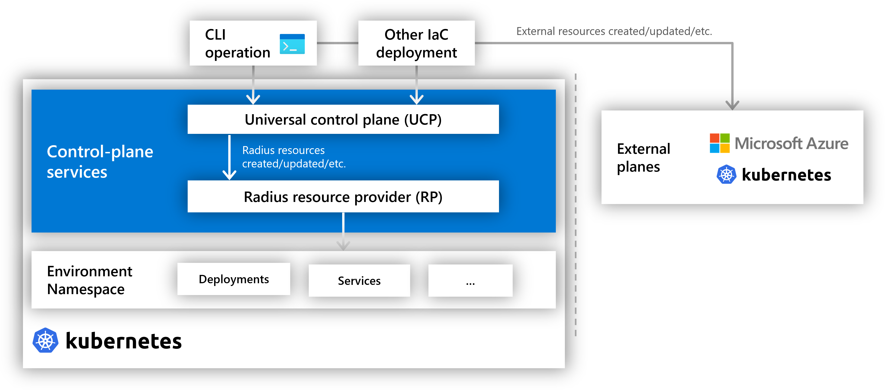

## Overview

The Project Radius control-plane is a set of services that accepts a Radius application definition and deploys it to the target platform.

## Services

| Service | Description |
|---------|-------------|
| **Universal control plane (UCP)** | The "front door" to the control-plane services. Provides authentication, authorization, routing, and other central capabilities. |
| **Radius resource provider (RP)** | Manages Radius applications and app-model resources. |
| **Deployment engine (DE)** | Orchestrates UCP and ARM deployments when Bicep or ARM JSON is used to deploy. |

### Universal control plane

The universal control plane (UCP) provides the front-door endpoint, authentication, authorization, and other central capabilities for a self-hosted Radius environment. When deploying to a Radius environment using a deployment JSON file (Bicep) or through single imperative commands (Radius CLI, other IaC tools), UCP handles the request and sends it to the appropriate plane.

Learn more about the deployment flows:



{}
When using Bicep to author and deploy Radius applications:

- A template is sent from UCP to the deployment engine (DE) for processing and orchestration
- DE interacts with the Radius RP to manage Radius resources, and with external planes for other resource types (Kubernetes, Azure, etc.)
- The RP handles CRUDL operations for Radius applications, links, and other app-model resources

{}

{}
When using the rad CLI or other IaC tools to deploy and interact with Radius applications:

- UCP routes the CRUDL requests directly to the Radius RP.
- The client (CLI, other IaC tools) acts as the DE in this case, bypassing the built-in DE.

{}



### Radius resource provider

The Radius resource provider handles CRUDL requests for Radius applications, links, and other app-model resources. The resource provider is split into two namespaces:

- **Applications.Core**: The _core_ resources of an application, including the application itself, containers, gateways, and routes.
- **Applications.Links**: The _link_ resources that can be used within an application.

Backing resources may be created or deleted by the Radius RP for some resources. For example, a Radius container creates a backing Pod or Container App on the target platform and container runtime.

### Deployment engine

The DE service is used when Bicep or ARM JSON is used to deploy Radius applications. It parses and builds the dependency graph of resources and orchestrates the CRUDL requests to the respective resource providers.

For imperative commands (CLI, other IaC tools), the DE is bypassed and the client (CLI, other IaC tools) acts as the DE.

## Next step

Now that you have an understanding of the Radius architecture, try Radius out:

