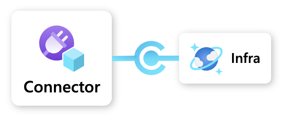
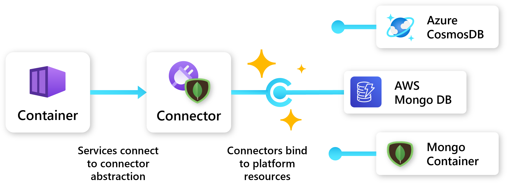
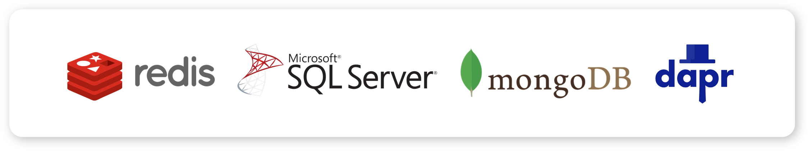

Connectors provide an **infrastructure abstraction** that enables **portability** for Radius applications. Connectors utilize open-source APIs, like Redis and MongoDB, to allow users to dynamically bind to platform resources. Instead of identifying a specific instance of a resource, users can specify a connector and the API it can talk to. Connectors support connecting directly to an existing resource and will soon support dynamic provisioning.

For example, when a user specifies a MongoDB connector, that connector could bind to an Azure CosmosDB, an AWS DynamoDB, or a Mongo Container based on which platform is targeted. An administrator could even specify the exact configurations of the database resource to spin up when a developer needs a database, enhancing a self-serve workflow.

## Supported connectors

Project Radius supports a large variety of connectors across databases, queues, caches, and other resource types.

See the [Connector docs]() for more information.

## Example

In this example, a team wants to use a Mongo Database and will be deploying to an environment running on Azure.

### Underlying resource

The CosmosDB resource, `underlyingdb`, will fulfill the app's Mongo storage requirement. This resource can be deployed by a central IT team or by the development team.



### Connector

In the app definition, a developer defines a Mongo connector, `dbconnector`, that references the CosmosDB resource.



The developer can bind to that resource without any configuration or knowledge of the underlying resource.  

### Container

The developer's container resource, `frontend`, connects to the Mongo connector, `dbconnector`, via the "connections" property:



## Next step

Now that you have an understanding of Radius connectors, learn more about Radius environments:


