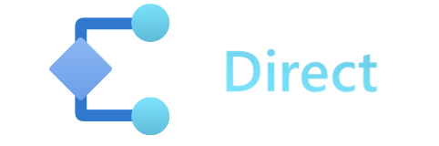

## Definition

The Radius Application contains everything on an app diagram. That includes all the compute, data, and infrastructure. 

<!-- TODO: expand this diagram to include more about the infra layer -->

<i>A Radius Application encompases all the containers, databases, and APIs for an app.</i>


## Authoring an Application

An application is defined as a top-level `resource app` in a .bicep file: 


Currently, this example app is an empty shell and has no child resources defined.

It's up to the user to define what they consider part of the app. Users can include both services (containers) and infrastructure resources (databases, caches, etc.). 

In some cases, an Ops team may create a Radius environment and prepare it with portable Radius [Connector]() resources that a separate Dev team can connect to from their `resource app`. 

Learn more about how to author applications in the [Authoring guide](). 

<!-- TODO: high-level overview of managing an app -->


Resources describe the code, data, and infrastructure pieces of an application.

Each node of an architecture diagram would map to one Resource. Together, an Application's Resources capture all of the important behaviors and requirements needed for a runtime to host that app. 

## Resource definition

In your app's Bicep file, a resource captures: 

| Property | Description | Example |
|----------|-------------|---------|
| **Resource type** | What type of thing is this? | `Container`
| **Name** | The logical name of the Resource, must be unique per-Application and resource type | `my-container`
| **Essentials** | How do I run this? | Container image and tag (`my-container:latest`)
| **Connections** | What other Resource will I interact with? | Need to read from `my-db` 
| **Routes** | What capabilities do I provide for others? | Offer an HTTP endpoint on `/home`
| **Traits** | What operational behaviors do I offer and interact with? | Need a Dapr sidecar (`dapr.io.App`)

### Examples

#### Example 1 
```bash
import applications 
 
resource app 'Applications.Core/applications' = { 
  name: 'cool-app' 
  properties: { 
    environment: applications.environmentId() 
  } 
} 
 
resource container 'Applications.Core/containers' = { 
  name: 'cool-backend' 
  properties: { 
    application: app.id 
    ... 
  } 
} 
 
resource container 'Microsoft.Apps/functions' = { 
  name: 'cool-function' 
  properties: { 
    application: app.id 
    ... 
  } 
} 
```

#### Example 2
```bash
resource app 'Applications.Core/applications@2022-03-15-privatepreview' = {
  name: 'azure-connection-database-service'
}

resource store 'Container' = {
  name: 'db-service'
  properties: {
    environment: applications.environmentId() 
    application: app.id
    container: {
      image: magpieimage
    }
    connections: {
      databaseresource: {
        kind:'azure'
        source: databaseAccount.id
        roles: [
          'Cosmos DB Account Reader Role'
          '230815da-be43-4aae-9cb4-875f7bd000aa'
        ]
      }
    }
  }
}


resource databaseAccount 'Microsoft.DocumentDB/databaseAccounts@2020-04-01' = {
  name: 'dbacc-${guid(resourceGroup().name)}'
  location: resourceGroup().location
  kind: 'MongoDB'
  properties: {
    environment: applications.environmentId() 
    application: app.id
    consistencyPolicy: {
      defaultConsistencyLevel: 'Session'
    }
    locations: [
      {
        locationName: resourceGroup().location
        failoverPriority: 0
        isZoneRedundant: false
      }
    ]
    databaseAccountOfferType: 'Standard'
  }
}
```

#### Example 3
  ```bash
  resource app 'Applications.Core/applications@2022-03-15-privatepreview' = {
    name: 'azure-resources-dapr-pubsub-generic'
    properties: { 
      environment: applications.environmentId() 
    } 
  } 

  resource publisher 'Container' = {
    name: 'publisher'
    properties: {
      environment: applications.environmentId() 
      application: app.id
      connections: {
        daprpubsub: {
          kind: 'dapr.io/PubSubTopic'
          source: pubsub.id
        }
      }
      container: {
        image: magpieimage
      }
    }
  }
  
  resource pubsub 'dapr.io.PubSubTopic@v1alpha3' = {
    name: 'pubsub'
    properties: {
      environment: applications.environmentId() 
      application: app.id
      kind: 'generic'
      type: 'pubsub.kafka'
      metadata: {
        brokers: 'dapr-kafka.kafka.svc.cluster.local:9092'
        authRequired: false
      }
      version: 'v1'
    }
  }
```


The following examples shows two Resources, one representing a [Container]() and the other describing a [Dapr State Store](https://docs.dapr.io/developing-applications/building-blocks/state-management/state-management-overview/).

#### Container



#### Dapr State Store



Other resources, like the `storefront` container above, can now connect to this Dapr State Store and save/get state items.

## Services 

A dev team's app code will likely center around core runnable resources, which we call services. Running code can be modeled with services like a container or an App Service. [Learn more]()

## Connecting to resources 

There are several ways a service resource (like a container) can connect to other supporting resources. 




[]()
Connect directly to Kubernetes() and Azure () resources. 

[Learn more]()



[]()
Add portability to your application through platform-agnostic resources.
[Learn more]()




Model and connect to external 3rd party resources<br /><br />
Coming soon!


