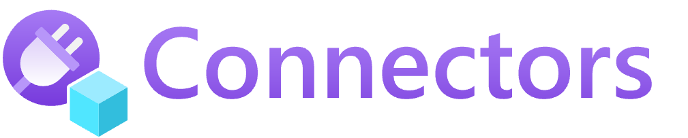

## Definition

The Radius Application contains everything on an app diagram. That includes all the compute, data, and infrastructure. 

<!-- TODO: expand this diagram to include more about the infra layer -->

<i>A Radius Application encompases all the containers, databases, and APIs for an app.</i>


## Authoring an Application

An application is defined as a top-level `resource app` in a .bicep file: 


Currently, this example app is an empty shell and has no child resources defined.

It's up to the user to define what they consider part of the app. Users can include both services (containers) and infrastructure resources (databases, caches, etc.). 

In some cases, an Ops team may create a Radius environment and prepare it with portable Radius [Connector]() resources that a separate Dev team can connect to from their `resource app`. 

Learn more about how to author applications in the [Authoring guide](). 

<!-- TODO: high-level overview of managing an app -->


Resources describe the code, data, and infrastructure pieces of an application.

Each node of an architecture diagram would map to one Resource. Together, an Application's Resources capture all of the important behaviors and requirements needed for a runtime to host that app. 

## Resource definition

In your app's Bicep file, a resource captures: 

| Property | Description | Example |
|----------|-------------|---------|
| **Resource type** | What type of thing is this? | `Container`
| **Name** | The logical name of the Resource, must be unique per-Application and resource type | `my-container`
| **Essentials** | How do I run this? | Container image and tag (`my-container:latest`)
| **Connections** | What other Resource will I interact with? | Need to read from `my-db` 
| **Routes** | What capabilities do I provide for others? | Offer an HTTP endpoint on `/home`
| **Traits** | What operational behaviors do I offer and interact with? | Need a Dapr sidecar (`dapr.io.App`)

### Example application 

- participating resources are not nested inside app resource
- some resources require app id to be specified 
- some resources require env id to be specified 
- all resources require location to be specified 

```sh
# Note: name used to import Radius types is a branding point. Alternative is `import applications`.
import radius as radius 
 
resource app 'Applications.Core/applications@2022-03-15-privatepreview' = { 
  name: 'my-app' 
  location: resourceGroup().location
  properties: { 
    environment: radius.environmentId() 
  } 
} 

# Radius container resource, application property required, can inherit environment property
resource container 'Applications.Core/containers@2022-03-15-privatepreview' = { 
  name: 'my-backend' 
  location: resourceGroup().location
  properties: { 
    application: app.id 
    connections: {
      mongo: {
        source: mongo.id
      }
    }
    ... 
  } 
} 

# Radius connector resource, application and environment properties required 
resource mongo 'Applications.Connector/mongoDatabases@2022-03-15-privatepreview' = {
  name: 'my-mongo'
  location: resourceGroup().location
  properties: {
    environment: radius.environmentId() 
    ...
  }
}

# Azure resource, no application property needed
resource database 'Microsoft.DocumentDB/databaseAccounts@2020-04-01' = {
  name: 'my-db' 
  location: 'westus2'
} 

# fyi, Kubernetes resources are extensible resources, not Radius or Azure resources. 
# They do not require location, app id, or env id. 
# Radius resources can depend on the outputs of these resources, but we don't have 
# connections to Kubernetes resources today. 
```


## Connecting to resources 

There are several ways a service resource (like a container) can connect to other supporting resources. 




[]()
Connect directly to Kubernetes() and Azure () resources. 

[Learn more]()



[]()
Add portability to your application through platform-agnostic resources.
[Learn more]()




Model and connect to external 3rd party resources<br /><br />
Coming soon!


