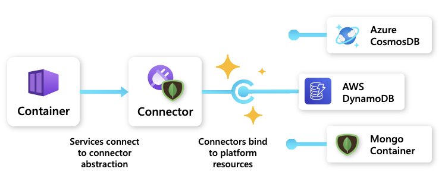

Connectors provide an **infrastructure abstraction** that enables **portability** for Radius applications. Connectors utilize open-source APIs, like Redis and MongoDB, to allow users to dynamically bind to platform resources. Instead of identifying a specific instance of a resource, users can specify a connector and the API it can talk to. Connectors support either spinning up a new resource or connecting directly to an existing resource.

For example, when a user specifies a MongoDB connector, that connector could bind to an Azure CosmosDB, an AWS DynamoDB, or a Mongo Container based on which platform is targeted. An administrator could even specify the exact configurations of the database resource to spin up when a developer needs a database, enhancing a self-serve workflow.

## Underlying resource

In this example, a team wants to use a Mongodb Database on Azure (`underlyingdb`) to fulfill their app's Mongo storage requirement:



## Connector

Then, in the app definition, a developer defines a Mongo connector (`dbconnector`) that references the storage resource (`underlyingdb`). 



The developer can bind to that resource without any configuration or knowledge of the underlying resource.  

## Container

Finally, the developer's container resource (`frontend`) connects to the Mongo connector (`dbconnector`) via the "connections" property:



## Connector categories

For examples on using the various Radius connectors, see [Connector Schemas]().