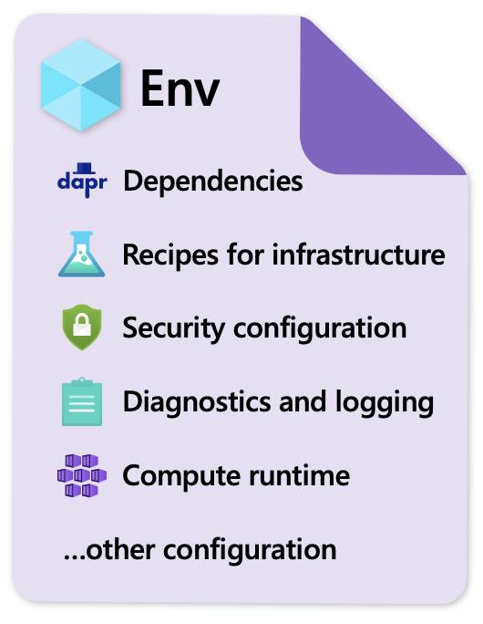

## Introduction
Radius environments can be thought of as a prepared landing zone for applications. Creating and configuring an environment results in a prepared pool of compute, networking, and dependency resources like databases. Then, a Radius application can be deployed into the environment, "binding" the app to the infrastructure. 

A

## Environment templates
Because environment definitions can be codified, central teams can define environment templates that let their dev teams hydrate fully-functioning environments in a self-service way - while following organization best practices like security confiugration. 



### What kinds of problems can environment templates solve?
#### Network configuration
Cloud providers such as Azure and AWS contain infrastructure services that simplify for users the configurations of virtual network, subnets, network security groups and user defined routes. AWS uses services such as Amazon Virtual Private Cloud and Azure uses Azure Virtual Network.
#### Secret management
Teams looking to use cloud services must deal with setting configurations for identity-based access control, setting algorithms for encryption, storing keys and secrets in managed key vault services and rotate keys and other secrets frequently to keep up with security requirements including but not limited to expiring certificates, leaked credentials and dealing with downtime.
#### Dependencies/Storage
Teams must often deal with managing the configurations of their storage services. There could be times were the settings applied to a CosmosDB for example could change rendering a need to update the infrastructure settings.
#### Diagnostics
Teams often use diagnostic settings through leveraging services like Azure Monitor. If a customer uses CosmoDB they have various available ways to choose from to connect to Azure Monitor and have various log settings ranging from retention policy to specific grouping types.
#### Identity Policies
Cloud providers such as Azure allow users to manage identities which provide credentials to access/limit user interactions with other services. If a user sets up a CosmoDB and assigns a managed identity for access today, they encounter that there are many different types of permissions that can be assigned such as the ability to read metadata, execute queries and add new data.

## Handoffs between teams
An example workflow might look like
- IT Pro defines the Radius environment specs in a template 
- IT Pro creates a Radius environment based on the template
  - The environment contains recipes for supporting infrastructure the devs might need, like for a Redis cache
- Developer defines a Radius application by writing an app.bicep file
  - The app references the Recipe for a Redis cache 
- Developer deploys the app to Azure 
  - Radius uses the Redis cache Recipe to deploy an Azure Cache for Redis instance on behalf of the user
  - Radius binds that new cache instance to the environment 
  - Radius wires up the connection to the new cache instance, automatically configuring security best practices, injecting ENV variables, etc.

<!-- (TODO - will convert this list ^ to a diagram by v0.12) -->

## Configuring environments
There are three main steps to configure a Radius environment, and by completing these steps a user will have successfully initialized an environment.

### 1. Optionally define the environment specs
Environments, like applications, are defined via Infrastructure-as-Code languages. You may choose to describe your environment's requirements and contents in an IaC file. If you don't define environment specs, an empty environment will be created. You can install additional services there later if needed. 
- For the list of supported IaC languages, see [Languages](). 
- For example environment definitions, see [link coming soon in other PR]
<!-- TODO add that link ^  -->

### 2. Create a Kubernetes cluster
Flavor and specs of your choosing (e.g. [Azure Kubernetes Service](https://docs.microsoft.com/en-us/azure/aks/tutorial-kubernetes-deploy-cluster), [Minikube](https://kubernetes.io/docs/tasks/tools/install-minikube/), [K3s](https://k3s.io))

### 3. Run `rad env init kubernetes`
Radius currently supports Kubernetes as the container runtime. We plan to support additional container runtimes in the future. 

This command will:
- If needed, install a Radius control plane
    - Install Radius control plane services via a set of Helm charts 
- Create a new environment 
    - Create a namespace to hold the environment resource 
    - Create an environment resource
    - Execute any environment installation templates (e.g. to install Dapr) 
- Walk users through configuring cloud providers to connect to public clouds 

Each AKS or EKS cluster requires 1 Radius control plane, but it may contain multiple Radius environmnents if desired. 

To verify that your environment initialized correctly, you should see it listed in the output of
```bash
rad env list
```
