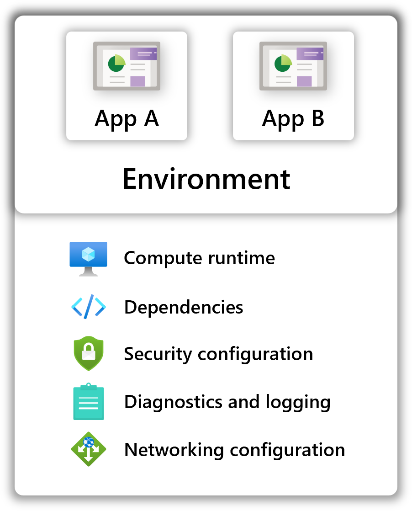

## Introduction

Radius environments are a prepared landing zone for applications. They contain a prepared pool of compute, networking, and shared resources. Radius applications deployed to that environment "bind" to that infrastructure. Configuration on the environment allow for operators to enforce organizational requirements and best practices for app teams.

Environments provide a grouping structure for applications and the resources they share. For example, an org might choose to setup separate Radius environments for staging and production. When appropriate, multiple applications can be deployed into the same environment.

## Concerns that environments manage

### Separation of concerns

In many small to medium-sized organizations, a full stack developer might write application code, author the Radius app definition, and create the Radius environment. In larger orgs, there may be separate teams of administrators and developers, where the central admins build environment templates which development teams leverage and deploy to. The separation of an app from an environment makes a separation of concerns possible.

With Radius environments, central operations and IT teams can define and share environments with development teams for them to deploy applications into. Ops teams focus on configuring the compute, dependencies, networking, and other infrastructure concerns, while developers focus on the business and application concerns. This allows each team to focus on what matters most to them, without needing to become experts in every aspect of the infrastructure and application.

### Developer productivity

Once an environment template is defined, developers can get up and running with a prepared development, pre-production, or production environment in minutes. No more waiting for manual provisioning or configuration or inter-team coordination.

### Replication and consistency

When an application team needs to scale an application to additional regions or instances, environments can be "stamped out" in minutes and ready for app deployments. Integrations with CI/CD systems such as GitHub Actions allow this process to be automated and repeatable.

### Organization best-practices

Organizational best-practices such as cost-optimization, resource sharing, and logging can all be codified and enforced with a Radius environment.

## Environment features

| Feature | Description |
|---------|-------------|
| **Compute runtime** | Define compute runtimes such as a Kubernetes cluster or Azure serverless compute *(coming soon)* where your application's services run. |
| **Shared infrastructure** | Deploy shared resources that are available to all applications deployed into the environment.
| **Diagnostics** *(coming soon)* | Configure and manage diagnostic configuration such as collection policies, retention periods, and archival settings.
| **Networking** *(coming soon)* | Define networking requirements such that applications are automatically configured with network isolation best-practices.
| **Identity & access** *(coming soon)* | Limit access to deployments, resources and capabilities based on user roles and assignments.
| **Dependencies** *(coming soon)* | Define environment requirements such as policy, packages, or other organization requirements.
| **Infrastructure provisioning** *(coming soon)* | Automatically provision connector infrastructure at deployment time using pre-defined or custom "recipes".
| **Dependency management** *(coming soon)* | Manage dependencies and environment capabilities such as packages, frameworks, and other configuration.

## Example: Handoff between teams

In this example there are two teams within an organization: a central administration team and a development team. The central administration team is responsible for managing the environment and the central infrastructure resources, and the development team is responsible for the application definition and deployment.

A typical workflow for this team structure would look like:

1. The administrator initializes a new environment, configured with a compute runtime setup with networking, identity, diagnostics, and other configuration that matches their org's requirements.
1. The developer authors a Radius application template, including containers for their services, connectors for their infrastructure, and routes/gateways for their networking.
1. The developer deploys the app template to the Radius environment
   - The app's containers automatically run on the container runtime
   - The connector automatically configures security best practices and injects connection information into the consuming container

When the developer deploys their application, these org-level concerns are automatically wired up based on the environment. Developers don't have to think about credentials or how networking is configured, enabling them to focus on their applications instead.

## Next step

Now that you have an understanding of Radius environments, learn more about the Radius control-plane and architecture:


