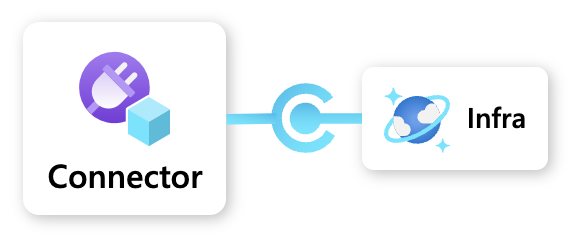
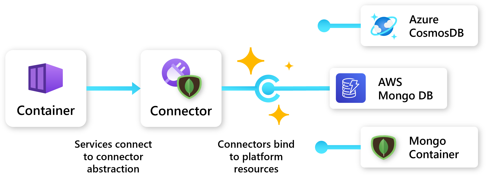
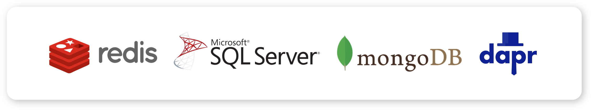

Links provide an **infrastructure abstraction** that enables **portability** for Radius applications. Links utilize open-source APIs, like Redis and MongoDB, to allow users to dynamically bind to platform resources. Instead of identifying a specific instance of a resource, users can specify a link and the API it can talk to. Links support connecting directly to an existing resource and will soon support dynamic provisioning.

For example, when a user specifies a MongoDB link, that link could bind to an Azure CosmosDB, or MongoDB services from other cloud providers. An administrator could even specify the exact configurations of the database resource to spin up when a developer needs a database, enhancing a self-serve workflow.

## Supported links

Project Radius supports a large variety of links across databases, queues, caches, and other resource types.

See the [Link docs]() for more information.

## Example

In this example, a team wants to use a Mongo Database and will be deploying to an environment running on Azure.

### Underlying resource

The CosmosDB resource, `underlyingdb`, will fulfill the app's Mongo storage requirement. This resource can be deployed by a central IT team or by the development team.



### Link

In the app definition, a developer defines a Mongo link, `dblink`, that references the CosmosDB resource.



The developer can bind to that resource without any configuration or knowledge of the underlying resource.  

### Container

The developer's container resource, `frontend`, connects to the Mongo link, `dblink`, via the "connections" property:



## Next step

Now that you have an understanding of Radius Links, learn more about the Radius API architecture:

