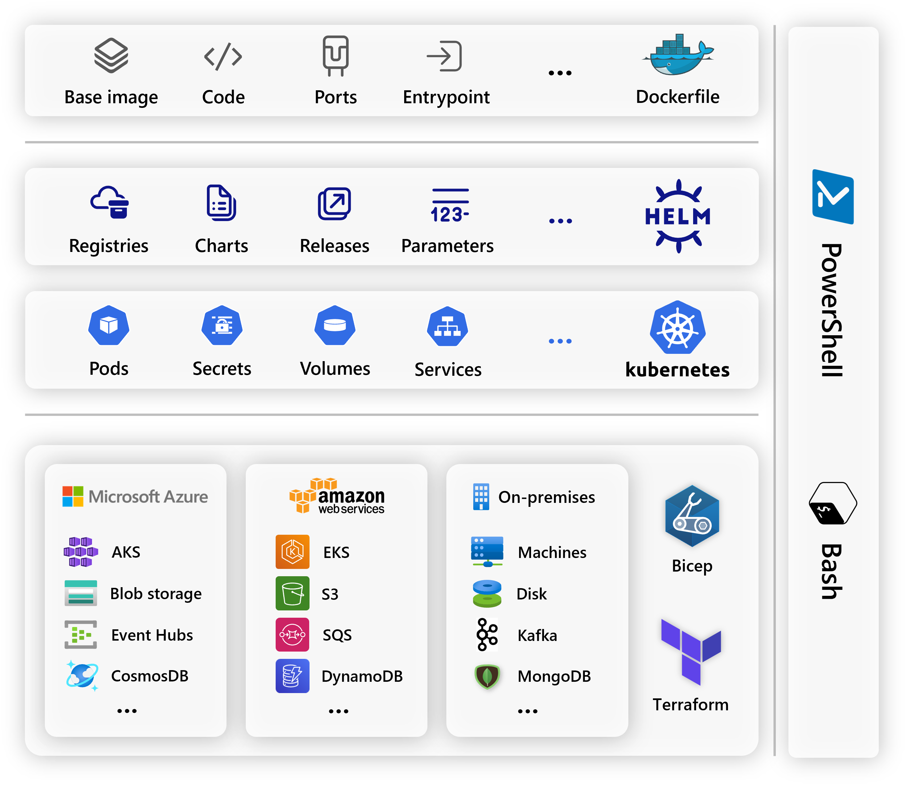
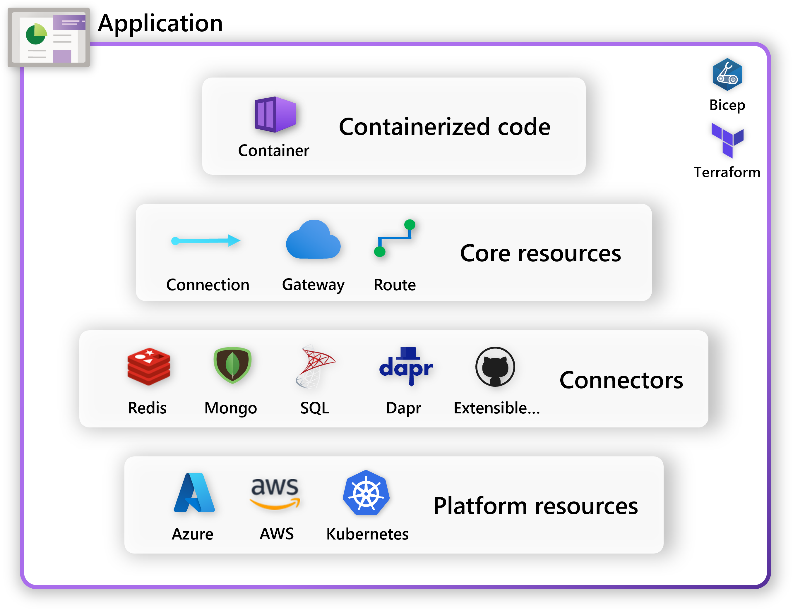
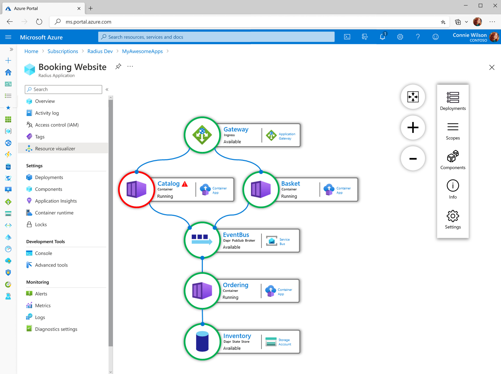
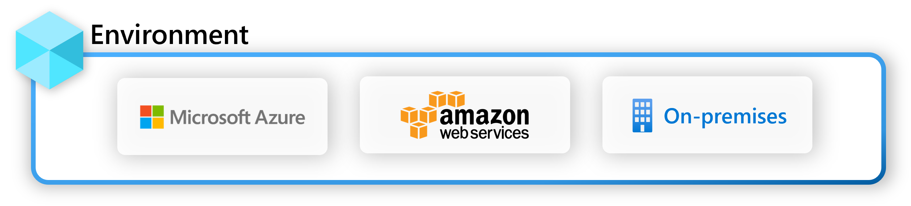
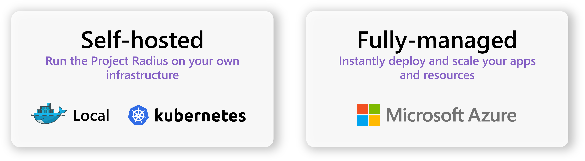

## Building cloud-native apps is too difficult today

App teams today struggle to model and deploy their applications. Complex architectures, cross-platform portability requirements, and org-level best-practices all make it difficult to not only model and deploy, but also maintain and troubleshoot large applications.

Apps today are modeled and deployed with Dockerfiles, Kubernetes CRDs, Helm charts, and infrastructure-as-code templates, with scripts to glue it all together. Plus, the range of infrastructure types (cloud, on-premises, serverless) can double or triple the work as teams figure out how to move apps between platforms.

Once deployed, teams don't have a way to view and manage apps holistically. Instead, they're drowning in lists of disjointed resources.

What's missing is a way to collapse the entire concept of an application into a single entity so it can be deployed, managed, and scaled easily.

## Project Radius empowers teams to focus on their apps

### Build a unified concept of your application

At the heart of Project Radius is a new **application resource**, with an accompanying set of resources and abstractions to describe your app's requirements and capabilities. These resources form the [Radius app model]().

These new resources form the [**Radius app model**](), which allow you to:

- Visualize the entire application, including its dependencies and relationships
- Investigate cross-app health and diagnostics, including dependencies and connections
- Identify ownership and locate artifacts
- Support handoff between teams as the app matures

The result is no longer just a flat list of resources - it's a fully codified abstraction of how the services and infrastructure relate to each other:

 

### Drastically reduce infra ops time

[App environments]() are landing zones for applications. They are the place where you can deploy, manage, and scale your apps.

Environments allow you to:

- Iterate quickly in an environment running locally, then scale that same app up in a production environment
- Stamp out versions of the app to the edge, to multiple geos, or even to multiple clouds
- Follow best practices to be naturally secure by default, even with many teams working together
- Easily layer IT policies across an app (access, backup, ...)

### Model applications as code

With the Radius app model, teams can easily codify and share pieces of an application. For example, a database owned by one team can seamlessly connect to a container with app code owned by a second team.




{{< rad file="snippets/appmodel-concept.bicep" embed=true marker="//SNIPPET" replace-key-container="//CONTAINER" replace-value-container="container: {...}" replace-key-properties="//PROPERTIES" replace-value-properties="properties: {...}" >}}




Radius uses the [Bicep language]() as its file-format and structure. It offers:

- A high quality authoring experience with modules, loops, parametrization, and templating
- ARM Deployment Stacks as the declarative deployment/rollback mechanism
- Ability to punch through abstractions to platform when necessary
- Extensions to work with other providers (e.g. Kubernetes, Azure Active Directory, etc.)

## Platform strategy

Project Radius aims to support all hosting platform types - from hyperscale cloud, to self-hosted Kubernetes on the edge, to IoT and edge devices.

### Application portability

The Radius app model is designed to be portable across all Radius-supported platforms. Combined with links and other frameworks such as [Dapr](https://dapr.io/), teams can write their apps once and deploy to any Radius-enabled platform in minutes.

### Consistent tooling

As teams onboard to Project Radius and begin deploying across platforms, the tooling and experiences are consistent everywhere. The [rad CLI]() works across every platform and environment. This allows teams to easily scale across platforms and be productive everywhere.

## Next step

Now that you have an overview of Project Radius, learn more about the Radius app model:


