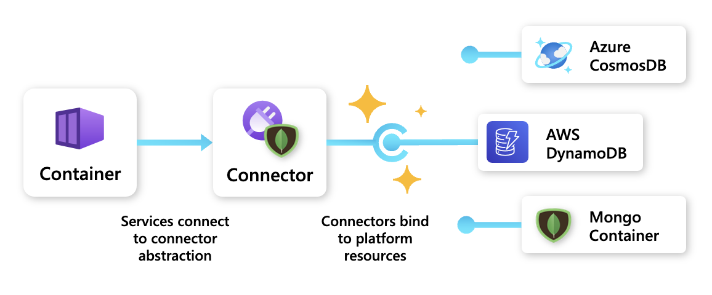
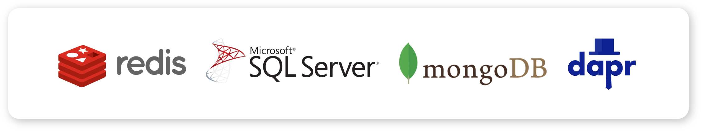

Project Radius makes it easy to migrate your application across cloud and edge.

## Connectors

Connectors provide an **infrastructure abstraction**, separating an app's requirement for an API or service, and the infrastructure providing the service. Connectors utilize open-source APIs, like Redis and MongoDB, to allow users to bind their apps to each platform's respective resources. Instead of identifying a specific instance of a resource, users can specify a connector and the API it can talk to.

For example, when a user specifies a MongoDB connector, that connector could bind to an Azure CosmosDB, an AWS DynamoDB, or a Mongo Container depending on which platform is targeted. Administrators have control over infrastructure configuration and setup, allowing developers to focus on their app logic and requirements instead of infrastructure configuration.

### Extensible and community driven

Connectors are designed to be extensible by the community, allowing teams to build connectors for their services and technologies.

 

For examples on using the various Radius connectors, see [Connector Schemas]().

### Dynamic infrastructure provisioning with recipes

Recipes allow connectors to automatically provision resources on demand when an application is deployed.

{}
Recipes is currently in development. Check back soon for more details on how to dynamically provision and bind to platform resources using connectors.
{}

## Example

In this example, a development team wants to use a Mongo database to store their app's data.

### Underlying infrastructure

The infra team begins by configuring an Azure CosmosDB account and database to provide the Mongo database:









### MongoDB connector

Next, within the app definition, a developer defines a Mongo connector (`dbconnector`) that references the storage resource (`mongodb`): 









The developer can bind to that resource without any configuration or knowledge of the underlying resource.  

### Consuming service

Finally, the developer's container resource (`frontend`) connects to the Mongo connector (`dbconnector`) via the "connections" property:









This connection automatically configured environment variables within the container with the connection string needed to access the MongoDB.

### Migration

If the team wants to migrate their app to a different platform, they can simply change the `resource` property of `dbconnector` to reference the new platform's MongoDB resource. The container will automatically get the new connection string for the new MongoDB resource.

## Next step

Now that you've learned how to add portability to your application, it's time to deploy it to a Radius environment:

