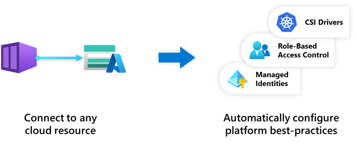

## Automate your application deployment

Because Radius has all the relationships and requirements of an application, it can be deployed and configured automatically. Developers no longer need to specify all the identity, networking, or other configuration that is normally required, and operators don’t need to write custom deployment scripts.

For example, if you want a container to read from an Azure Storage Account without using Radius, this normally requires creating managed identities, RBAC roles, identity federation, Kubernetes service accounts, and more. With Radius, developers can define a single [connection]() from their container to a Storage Account, and Radius sets up all the required configuration automatically.



## Run an application

Once you have [authored an application](), you can run an application using the [`rad run`]() command.

```bash
 rad run app.bicep
 ```

This will deploy the application to your environment, create port-forwards for all container ports, and stream container logs to the console.

## Deploy an application

An application can be deployed to an environment with [`rad deploy`]():

```bash
 rad deploy app.bicep
 ```
 This will deploy the application to the created Radius environment.

### Parameters

Parameters can be included as part of `rad run` or `rad deploy` via the `-p/--parameters` flag:

```bash
 rad deploy app.bicep -p param1=value1 -p param2=value2
 ```

 This will deploy the application to the created Radius environment injecting the parameters into the application.

 You can find more examples of deploying applications with parameters [here]().
 
