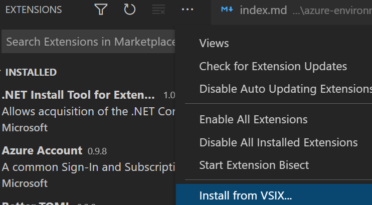

## Install `rad` CLI

The `rad` CLI manages your applications, resources, and environments. Begin by installing it on your machine:



{}

```powershell
iwr -useb "https://get.radapp.dev/tools/rad/install.ps1" | iex
```


To install the latest edge version:

```powershell
$script=iwr -useb  https://radiuspublic.blob.core.windows.net/tools/rad/install.ps1; $block=[ScriptBlock]::Create($script); invoke-command -ScriptBlock $block -ArgumentList edge
```

{}

{}
```bash
curl -fsSL "https://get.radapp.dev/tools/rad/install.sh" | /bin/bash
```


To install the latest edge version:

```bash
curl -fsSL "https://radiuspublic.blob.core.windows.net/tools/rad/install.sh" | /bin/bash -s edge
```

{}

{}
```bash
wget -q "https://get.radapp.dev/tools/rad/install.sh" -O - | /bin/bash
```


To install the latest edge version:

```bash
wget -q "https://radiuspublic.blob.core.windows.net/tools/rad/install.sh" -O - | /bin/bash -s edge
```

{}

{}
[Azure Cloud Shell](https://docs.microsoft.com/en-us/azure/cloud-shell/overview) is an interactive, authenticated, browser-accessible shell for managing Azure resources.

Azure Cloud Shell for bash doesn't have a sudo command, so users are unable to install Radius to the default `/usr/local/bin` installation path. To install the rad CLI to the home directory, run the following commands:

```bash
export RADIUS_INSTALL_DIR=./
wget -q "https://get.radapp.dev/tools/rad/install.sh" -O - | /bin/bash
```

You can now run the rad CLI with `./rad`.

PowerShell for Cloud Shell is currently not supported.
{}

{}
1. Download the `rad` CLI from one of these URLs:

   - MacOS: https://get.radapp.dev/tools/rad/edge/macos-x64/rad
   - Linux: https://get.radapp.dev/tools/rad/edge/linux-x64/rad
   - Windows: https://get.radapp.dev/tools/rad/edge/windows-x64/rad.exe

1. Ensure the user has permission to execute the binary and place it somewhere on your PATH so it can be invoked easily.


### Edge releases

- MacOS: https://radiuspublic.blob.core.windows.net/tools/rad/edge/macos-x64/rad
- Linux: https://radiuspublic.blob.core.windows.net/tools/rad/edge/linux-x64/rad
- Windows: https://radiuspublic.blob.core.windows.net/tools/rad/edge/windows-x64/rad.exe

{}



> You may be prompted for your sudo password during installation. If you are unable to sudo you can install the rad CLI to another directory by setting the `RADIUS_INSTALL_DIR` environment variable with your intended install path.

Verify the rad CLI is installed correctly by running `rad`. 

## Try out Radius on GitHub Codespaces

*Visit the [GitHub docs]() if you need access to the organization*

Do you prefer to test out Radius in a fast and easy to use virtual environment? Check out the [official Radius samples repo](https://github.com/project-radius/samples) and test out the sample applications on a pre-configured [GitHub Codespaces](https://github.com/features/codespaces) container.

If in case you'd prefer to run a dev container on your local machine, the [Radius samples repo](https://github.com/project-radius/samples) offers a .devcontainer folder that will allow you to configure the environment anywhere you want as well as automatically set up a [Radius local environment](#create-a-radius-environment). _Learn more: [Dev containers docs](https://code.visualstudio.com/docs/remote/containers)._

After you launching your codespace or dev container, navigate into your desired sample application directory and run `rad app deploy` to see Radius in action.

## Create a Radius environment

A Radius environment is where you will deploy your applications. Easily deploy a new environment with the [`rad env init`]() command:

### Pre-requisites

- Kubernetes cluster configured as the default `kubectl` context (verify with `kubectl config current-context`)


```sh
rad env init kubernetes
```

## Install VS Code extension (optional)

Optionally install the Radius [Visual Studio Code](https://code.visualstudio.com/) extensions for syntax highlighting, auto-completion, and linting.

{}
While Project Radius is in preview two separate extensions are required, one for Bicep highlighting and one for interacting with Radius applications. In a future release, these will be combined into a single extension.
{}

1. Download the latest extensions

   

   {}
   

   

   
   

   
   
   {}

   {}

   ```bash
   curl https://radiuspublic.blob.core.windows.net/tools/vscode/stable/rad-vscode-bicep.vsix --output rad-vscode-bicep.vsix
   curl https://radiuspublic.blob.core.windows.net/tools/vscode/stable/rad-vscode.vsix --output rad-vscode.vsix
   ```

   {}

   

2. Install the `.vsix` files:

   

   {}
   In VSCode, manually install the extension using the *Install from VSIX* command in the Extensions view command drop-down.

   

   {}

   {}
   You can also import this extension on the [command-line](https://code.visualstudio.com/docs/editor/extension-gallery#_install-from-a-vsix) with:

   ```bash
   code --install-extension rad-vscode-bicep.vsix
   code --install-extension rad-vscode.vsix
   ```

   If you're on macOS, make sure to [setup the `code` alias](https://code.visualstudio.com/docs/setup/mac#_launching-from-the-command-line).

   {}

   

3. Disable the official Bicep extension if you have it installed. Do not install it if prompted, our custom extension needs to be responsible for handling `.bicep` files and you cannot have both extensions enabled at once.

4. If running on Windows Subsystem for Linux (WSL), make sure to install the extension in WSL as well:

   


## Learn Radius

| Guides | Description  |
| --- | ----------- |
| [Tutorial]() | Walk through an in-depth example to learn more about how to work with Radius concepts |
| [Quickstarts]() | Learn about Project Radius topics via quickstart guides, complete with code samples |
| [Reference Applications]() | See how full applications are modeled in Project Radius |
| [Supported Languages]() | Learn how to model apps using various IaC tools |
