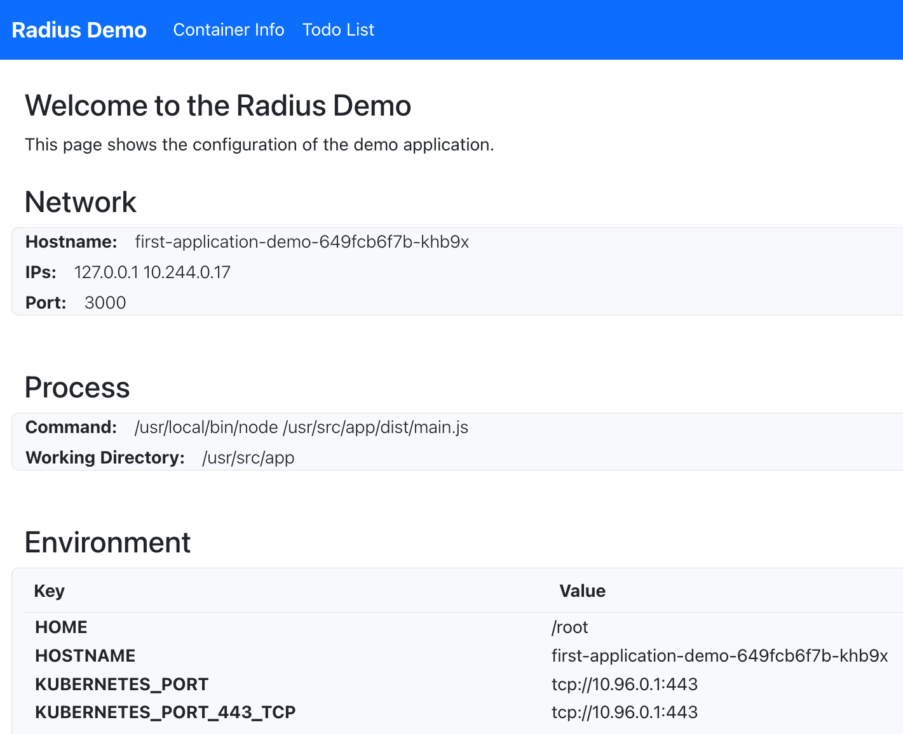
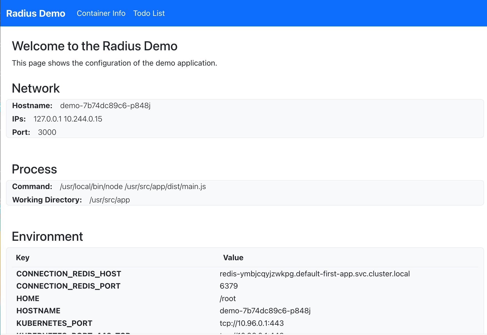

This guide offers the quickest way to get started using Radius. You'll walk through both installing Radius and running your first Radius app.

**Estimated time to complete: 10 min**

## 1. Have your Kubernetes cluster handy

Radius runs inside [Kubernetes](). However you run Kubernetes, get a cluster ready.

> *If you don't have a preferred way to create Kubernetes clusters, you might try using [k3d](https://k3d.io/), which runs a minimal Kubernetes distribution in Docker.*

Ensure your cluster is set as your current context:

```bash
kubectl config current-context
```

## 2. Install Radius CLI



{}
```bash
curl -fsSL "https://get.radapp.dev/tools/rad/install.sh" | /bin/bash
```
{}

{}
```bash
wget -q "https://get.radapp.dev/tools/rad/install.sh" -O - | /bin/bash
```
{}

{}
```powershell
iwr -useb "https://get.radapp.dev/tools/rad/install.ps1" | iex
```
{}



Visit the [installation]() page for troubleshooting or additional options.

Verify the rad CLI is installed correctly by running `rad version`. 

Example output:
```
RELEASE   VERSION   BICEP     COMMIT
0.15.0    v0.15.0   0.11.13   2e60bfb46de73ec5cc70485d53e67f8eaa914ba7
```

## 3. Initialize Radius

Create a new directory for your app and navigate into it:

```bash
mkdir first-app
cd first-app
```

Initialize Radius. For this example, accept all the default options (press ENTER to confirm): 

```bash
rad init --dev
```

Example output:

```
✔ k3d-k3s-default
Setup application in the current directory [Y/n]?:
Installing Radius version v0.15.0 control plane...
Creating environment default...
Successfully wrote configuration to /home/vscode/.rad/config.yaml
Created ".rad/rad.yaml"
```

In addition to starting Radius services in your Kubernetes cluster, this initialization command creates a default application (`app.bicep`) as your starting point. It contains a single container definition (`demo`). 



> This file will run the `radius.azurecr.io/tutorial/webapp` image. This image is published by the Radius team to a public registry, you do not need to create it.

## 4. Run the app

Use the `rad run` command to run the app in your environment:

```bash
rad run app.bicep
```

This command:

- Runs the application in your Kubernetes cluster
- Creates a port-forward from localhost to port 3000 inside the container so you can navigate to the app's frontend UI
- Streams container logs to your terminal

Access the application by opening [http://localhost:3000](http://localhost:3000) in a browser:


<br /><br />
Congrats! You're running your first Radius app.

When you're ready to move on to the next step, use `CTRL+C` to exit the command.

## 5. Add Database

This step will add a database (Redis Cache) to the application.

You can create a Redis Cache using [Recipes]() provided by Radius. The Radius community provides Recipes for running commonly used application dependencies, including Redis.

In this step you will:

- Add Redis to the application using a Recipe.
- Connect to Redis from the `demo` container using environment variables that Radius automatically sets.

Open `app.bicep` in your editor and get ready to edit the file.

First add some new code to `app.bicep` by pasting in the content below:



The code you just added creates a Redis Cache resource and specifies that it should be created by a Recipe.

Next, add this code to the container definition inside `properties`:



The code you just added creates a connection between the container and the database. Based on this connection, Radius will define environment variables in the container that tell the container how to connect. You will view these in the next step.

The finished `app.bicep` should like this:



## 6. Rerun the application with a database

Use `rad run` to run the updated application again:

```sh
rad run app.bicep
```

Open the browser to [http://localhost:3000](http://localhost:3000) and you should see that the environment variables have changed. The `demo` container now has connection information for Redis (`CONNECTION_REDIS_HOST`, `CONNECTION_REDIS_PORT`).


<br /><br />

Navigate to the TODO page and test out the application. Using the TODO page will update the saved state in Redis.

Press CTRL+C when you are finished with the website.

## Recap and next steps

It's easy to build on the default app and add more resources to the app. 

To delete your app, see [rad app delete]().

<br>

