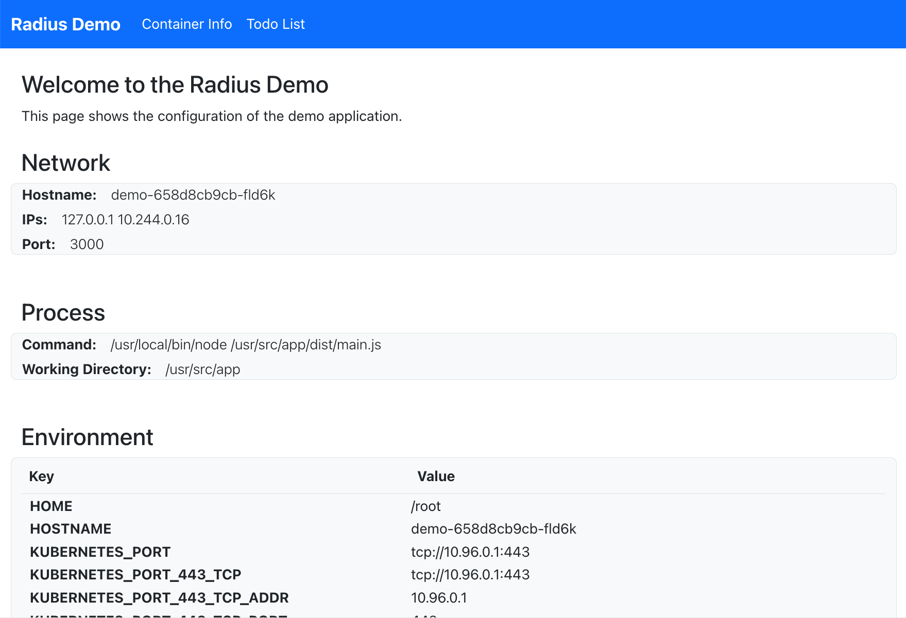

This guide offers the quickest way to get started using Radius. You'll walk through both installing Radius and running your first Radius app.

**Estimated time to complete: 10 min**

### 1. Have your Kubernetes cluster handy

Radius runs inside [Kubernetes](). So, however you run Kubernetes, get a cluster ready. 

If you don't have a preferred way to create Kubernetes clusters, you might try using [k3d](https://k3d.io/), which runs a minimal Kubernetes distribution in Docker. 

### 2. Install Radius



{}
```bash
curl -fsSL "https://get.radapp.dev/tools/rad/install.sh" | /bin/bash
```
{}

{}
```bash
wget -q "https://get.radapp.dev/tools/rad/install.sh" -O - | /bin/bash
```
{}

{}
```powershell
iwr -useb "https://get.radapp.dev/tools/rad/install.ps1" | iex
```
{}



Visit the [installation]() page for troubleshooting or additional options.

Verify the rad CLI is installed correctly by running `rad version`. 

Example output:
```
RELEASE   VERSION   BICEP     COMMIT
0.15.0    v0.15.0   0.11.13   2e60bfb46de73ec5cc70485d53e67f8eaa914ba7
```

### 3. Initialize Radius

Create a new directory for your app and navigate into it:
```bash
mkdir first-app && cd first-app
```

Initialize Radius. For this example, accept all the default options (press ENTER to confirm): 

```bash
rad init --dev
```

Example output:
```
✔ k3d-k3s-default
Setup application in the current directory [Y/n]?: y
Using existing environment k3d-k3s-default...
Successfully wrote configuration to /home/vscode/.rad/config.yaml
Created ".rad/rad.yaml"
```

In addition to starting Radius services in your Kubernetes cluster, this initialization command creates a default application (`app.bicep`) as your starting point. It contains a single container definition (`demo`). 



> This file will run the `radius.azurecr.io/tutorial/demo` image. This image is published by the Radius team to a public registry, you do not need to create it.


### 4. Run the app

```bash
rad run app.bicep
```

This command:

- Runs the application in your Kubernetes cluster
- Creates a port-forward from localhost to port 3000 inside the container so you can navigate to the app's frontend UI
- Streams container logs to your terminal

Access the application by opening [http://localhost:3000](http://localhost:3000) in a browser. 



Congrats! You're running your first Radius app. 

### Recap and next steps

It's easy to build on the default app and add more resources to the app. 

To delete your app, see [rad app delete]().

<br>


