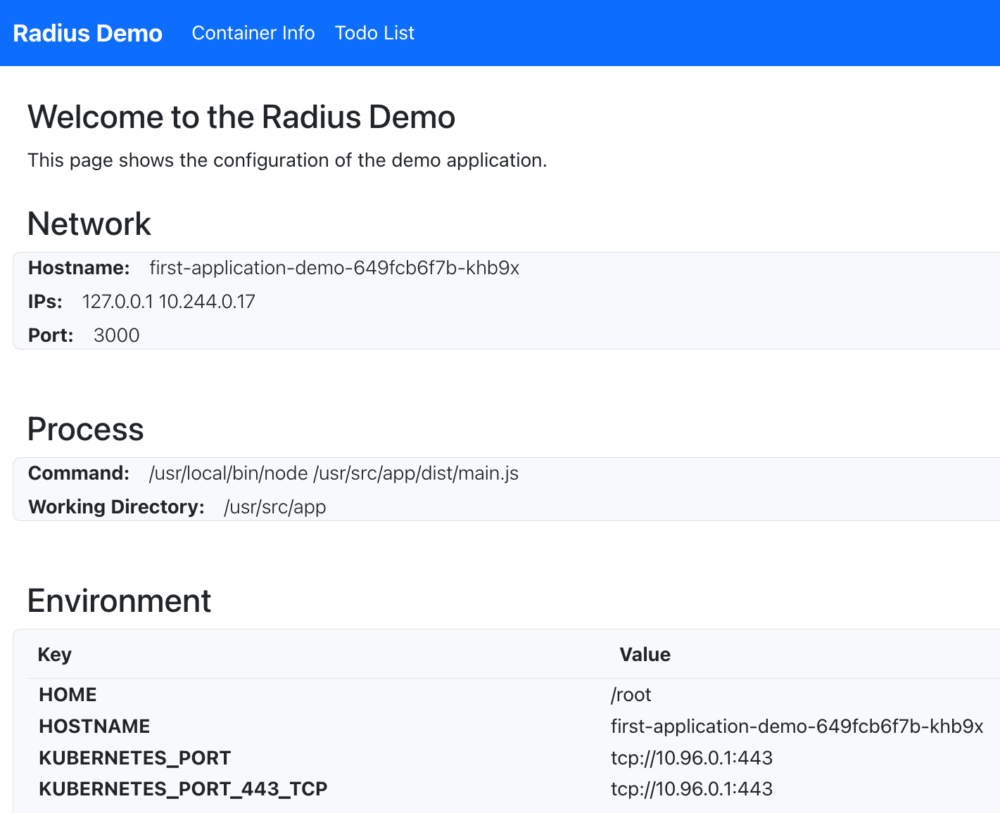

{}
This is a prototype of a new intro to Radius that we'd show users before the current tutorial. Right now the focus is to 
highlight the right experiences and features of Radius to make it sound compelling. 

🚧🚧🚧 Not everything on this page has been built yet. For now just read this, and don't try these commands. 🚧🚧🚧

The code samples on this page are idealized, and represent the north-star for how much we can simplify the current experience. We will require a few steps to get there.
{}

In this guide, you will use Radius run a pre-built application on Kubernetes and take a tour of some Radius features. In addition to running the application you will:

- See application logs at the command line.
- Add a Redis Cache to the application.
- View application status in the dashboard UI.

This guide should take about 15 minutes to complete.

### Pre-requisites


Use our [GitHub Codespace](https://github.com/features/codespaces) to run your first application. This is free to use, and is ready for you to get started with Radius immediately.

<a class="btn btn-primary" href="https://aka.ms/ProjectRadius/Codespace" role="button" target="_blank">Launch a new Codespace</a>

_Visit the [GitHub docs]() if you need access to the organization._


Alternatively, you can follow these instructions to set up your machine: ().

### Step 1: Initialize the application

Create an empty directory named `first-application` and open it in your commandline shell of choice.

Run `rad init --dev` and accept all of the default options (press ENTER to confirm). 

```bash
rad init --dev
```

**Output**

```txt
➜ rad init --dev
Setup application in the current directory [Y/n]?: Y
Doing first-time setup for development...
Created "app.bicep"
Created ".rad/rad.yaml"
```

[`rad init --dev`]()  will:

- Setup your Kubernetes environment for development.
- Scaffold a sample application and configuration.

### Step 2: Deploy the application

The `app.bicep` in your local directory contains a single container definition (`demo`).

```bicep
import radius

resource demo 'Applications.Core/containers' = {
  name: 'demo'
  properties: {
    container: {
      image: 'radius.azurecr.io/tutorial/demo'
      ports: {
        web: {
          containerPort: 3000
        }
      }
    }
  }
}
```

This file will run the `radius.azurecr.io/tutorial/demo` image. This image is published by the Radius team to a public registry, you do not need to create it.

Run with the following command:

```bash
rad run
```

`rad run` will:

- Run the application in Kubernetes.
- Display streaming logs on the terminal.
- Open a port-forward from localhost to port 3000 inside the container.

Leave this command running while doing the next steps.

### Step 3: View the application

You can now access the application by opening [http://locahost:3000](http://localhost:3000) in a browser. 

{}
Port 3000 was selected based on the container port used by `demo`. If port 3000 is unavailable on your system then `rad run` will choose a different port. Look at the console output to confirm which port was used.
{}

It will look like this:




### Step 4: View application logs

The terminal will show streaming logs from the application. You should be able to see logs from `demo` starting up, as well additional logging for each page you visit.

When you're ready to move on, press CTRL+C in your terminal.

### Step 4: Add Redis

You may have noticed that the TODO page of the application has a banner explaining that the database has yet not been configured. This step will add a Redis Cache to the application.

You can create a Redis Cache using [Recipes]() provided by Radius. The Radius community provides Recipes for running commonly used application dependencies, including Redis.

In this step you will a Recipe to:

- Add Redis to the application.
- Connect to Redis from the `demo` container using environment variables that Radius automatically sets.

Open `app.bicep` in your editor and get ready to edit the file.

{}
This is where instructions for how to edit `app.bicep` will go. I'm going to skip writing this out until we lock on the content.
{}

The finished `app.bicep` should like this:

```bicep
import radius

resource demo 'Applications.Core/containers' = {
  name: 'demo'
  properties: {
    container: {
      image: 'radius.azurecr.io/tutorial/demo:edge'
      ports: {
        web: {
          containerPort: 3000
        }
      }
    }
    connections: {
      redis: {
        source: redis.id
      }
    }
  }
}

resource redis 'Applications.Recipes/redisCaches' = {
  name: 'redis'
  properties: {
    mode: 'recipe'
  }
}
```

## Step 5: Run again

Use `rad run` to run the updated application again:

```sh
rad run
```

Open the browser to [http://locahost:3000](http://localhost:3000) and you should see that the environment variables have changed. The `demo` container now has connection information for Redis.

Navigate to the TODO page and test out the application. Using the TODO page will update the saved state in Redis. You will see console output for each from `redis` for each of these operations, because the Recipe for Redis includes this functionality.

Press CTRL+C when you are finished with the website.

## Step 6: View application in Radius Dashboard

Radius provides a dashboard UI that you can use to view your deployed applications. 

Open the dashboard using `rad dashboard`:

```bash
rad dashboard
```

This command will open the dashboard in your default browser and navigate to the current application. It should look like:

{}
This is where a screenshot will go when we've built the dashboard. 
{}

{}
If you highlight the node for `redis` you can learn about how it works. In this case you are using the development recipe, which is hosting Redis inside the Kubernetes.

Each recipe will create Kubernetes resources or cloud services. Radius stores this information and can show the relationships and links to cloud services from the dashboard.
{}

The dashboard can display:

- The parts that make up the application (`demo` and `redis`).
- Connections between part of the application (`demo -> redis`).
- Backing resources or cloud services (`redis -> Kubernetes primitives`)

Press CTRL+C when you are finished with the dashboard.

## Step 6: Delete application

Use `rad app delete` to delete the application:

```
rad app delete
```

This will clean up the container and Redis cache that are running in Kubernetes.

