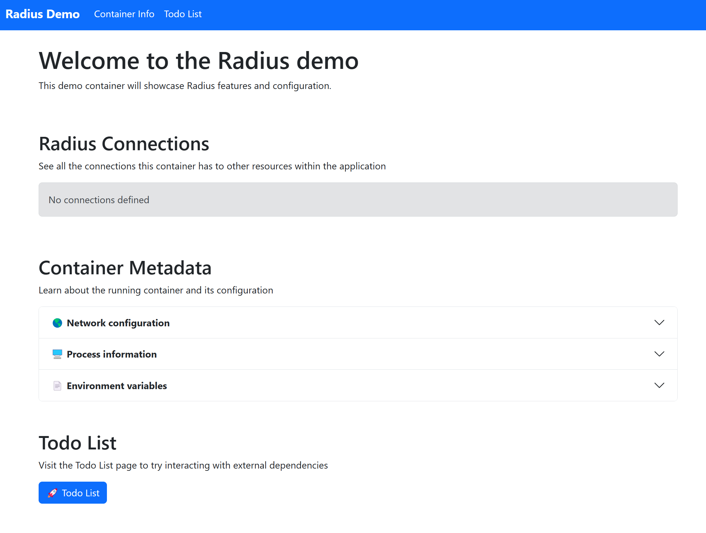
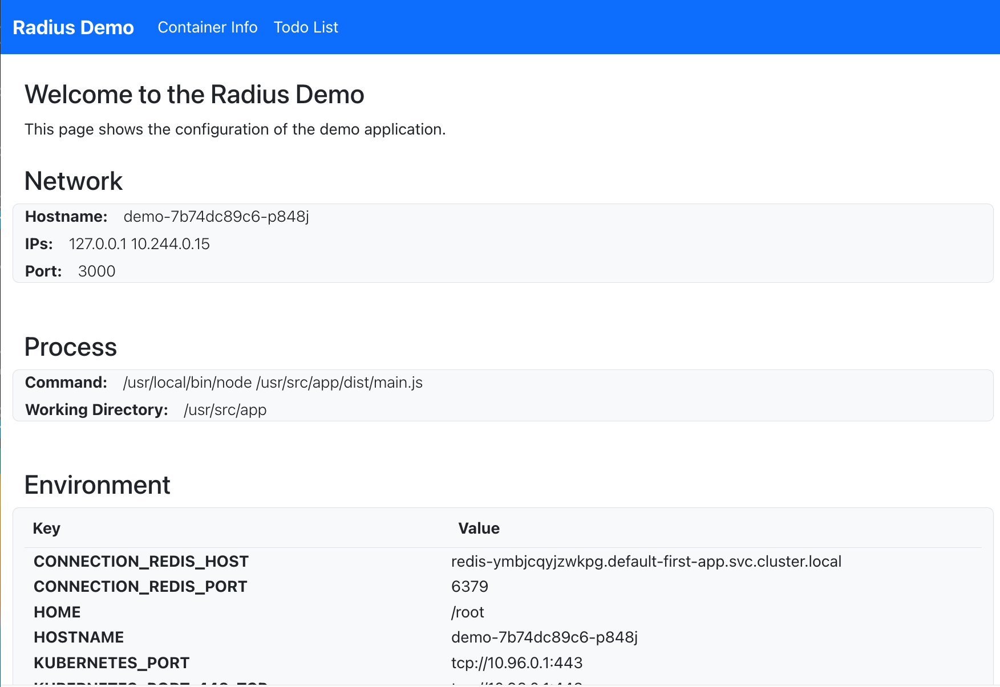
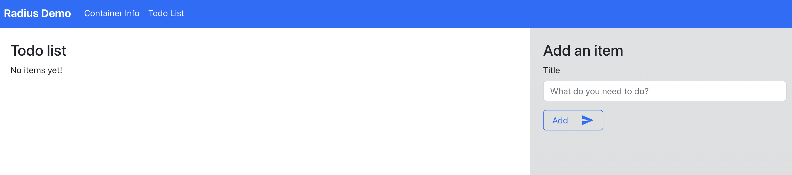

This guide will show you how to quickly get started with Radius. You'll walk through both installing Radius and running your first Radius app.

**Estimated time to complete: 10 min**

## 1. Have your Kubernetes cluster handy

Radius runs inside [Kubernetes](). However you run Kubernetes, get a cluster ready.
> *If you don't have a preferred way to create Kubernetes clusters, you could try using [k3d](https://k3d.io/), which runs a minimal Kubernetes distribution in Docker.*

Ensure your cluster is set as your current context:

```bash
kubectl config current-context
```

## 2. Install Radius CLI



{}
```bash
curl -fsSL "https://get.radapp.dev/tools/rad/install.sh" | /bin/bash
```
{}

{}
```bash
wget -q "https://get.radapp.dev/tools/rad/install.sh" -O - | /bin/bash
```
{}

{}
```powershell
iwr -useb "https://get.radapp.dev/tools/rad/install.ps1" | iex
```
{}



Visit the [rad CLI]() page for troubleshooting or additional options.

Verify the rad CLI is installed correctly by running `rad version`. 

Example output:
```
RELEASE   VERSION   BICEP     COMMIT
0.15.0    v0.15.0   0.11.13   2e60bfb46de73ec5cc70485d53e67f8eaa914ba7
```

## 3. Initialize Radius

Create a new directory for your app and navigate into it:

```bash
mkdir first-app
cd first-app
```

Initialize Radius. For this example, accept all the default options (press ENTER to confirm): 

```bash
rad init
```

Example output:

```
✔ k3d-k3s-default
Setup application in the current directory [Y/n]?:
Installing Radius version v0.15.0 control plane...
Creating environment default...
Successfully wrote configuration to /home/vscode/.rad/config.yaml
Created ".rad/rad.yaml"
```

In addition to starting Radius services in your Kubernetes cluster, this initialization command creates a default application (`app.bicep`) as your starting point. It contains a single container definition (`demo`). 

{{< rad file="snippets/app.bicep" embed=true markdownConfig="{linenos=table,linenostart=1}" >}}

> This file will run the `radius.azurecr.io/tutorial/webapp` image. This image is published by the Radius team to a public registry, you do not need to create it.

## 4. Run the app

Use the below command to run the app in your environment, then access the application by opening [http://localhost:3000](http://localhost:3000) in a browser.

```bash
rad run app.bicep
```

This command:

- Runs the application in your Kubernetes cluster
- Creates a port-forward from localhost to port 3000 inside the container so you can navigate to the app's frontend UI
- Streams container logs to your terminal


<br /><br />
Congrats! You're running your first Radius app.

When you're ready to move on to the next step, use `CTRL+C` to exit the command.

## 5. Add Database

This step will add a database (Redis Cache) to the application.

You can create a Redis Cache using [Recipes]() provided by Radius. The Radius community provides Recipes for running commonly used application dependencies, including Redis.

In this step you will:

- Add Redis to the application using a Recipe.
- Connect to Redis from the `demo` container using environment variables that Radius automatically sets.

Open `app.bicep` in your editor and get ready to edit the file.

First add some new code to `app.bicep` by pasting in the content below at the end of the file. This code creates a Redis Cache using a Radius Recipe:

{{< rad file="snippets/app-with-redis-snippets.bicep" embed=true marker="//REDIS" markdownConfig="{linenos=table,linenostart=21}" >}}

Next, update your container definition to include `connections` inside `properties`. This code creates a connection between the container and the database. Based on this connection, Radius will [inject environment variables]() into the container that inform the container how to connect. You will view these in the next step.

{{< rad file="snippets/app-with-redis-snippets.bicep" embed=true marker="//CONNECTION" markdownConfig="{linenos=table,hl_lines=[\"13-17\"],linenostart=7}" >}}

Your updated `app.bicep` will look like this:

{{< rad file="snippets/app-with-redis.bicep" embed=true markdownConfig="{linenos=table}" >}}

## 6. Rerun the application with a database

Use the command below to run the updated application again, then open the browser to [http://localhost:3000](http://localhost:3000).

```sh
rad run app.bicep
```

You should see that the environment variables have changed. The `demo` container now has connection information for Redis (`CONNECTION_REDIS_HOST`, `CONNECTION_REDIS_PORT`).


<br /><br />

Navigate to the TODO List tab and test out the application. Using the TODO page will update the saved state in Redis.


<br /><br />

Press CTRL+C when you are finished with the website.

## Recap and next steps

It's easy to build on the default app and add more resources to the app. 

To delete your app, see [rad app delete]().

<br>

