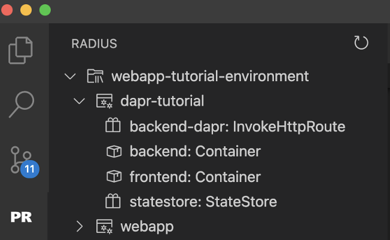

## Create a Bicep file

Radius uses the [Bicep language]() as its file-format and structure. In this tutorial you will define an app named `dapr-tutorial` that will contain the containers, statestore, and route resources, all described in Bicep.

Create a new file named `dapr.bicep` and paste the following:



## Add `backend` container

Next you'll add a `backend` [container]() resource for the website's backend.

Radius captures the relationships and intentions behind an application, which simplifies deployment and management. The single `backend` resource in your Bicep file will contain everything needed for the website backend to run.

Your `backend` resource, which has resource type Container, will specify:

- **container image:** `radius.azurecr.io/daprtutorial-backend`, a Docker image the container will run. This is where your application's backend code lives.
- **ports**: orders will be received on port 3000.

Update your dapr.bicep file to match the full application definition:



## Deploy the application

Now you are ready to deploy the application for the first time.

1. Deploy to your Radius environment via the rad CLI:

   ```sh
   rad deploy dapr.bicep
   ```

   This will deploy the application into your environment and launch the container resource for the backend website.

1. Confirm that your Radius application was deployed:

   ```sh
   rad resource list --application dapr-tutorial
   ```

   You should see your `backend` resource. Example output:

   ```
   RESOURCE   TYPE
   backend    Container
   ```

1. To test your `dapr-tutorial` application, open a local tunnel to your application:

   ```sh
   rad resource expose Container backend --application dapr-tutorial --port 3000
   ```

   {}
   The [`rad resource expose`]() command accepts the resource type, the resource name, and flags for application name and port. If you changed any of these values when deploying, update your command to match.
   {}

1. Visit the URL http://localhost:3000/order in your browser. For now, you should see a message like:

   ```
   {"message":"The container is running, but Dapr has not been configured."}
   ```

   If the message matches, then it means that the container is running as expected.

1. When you are done testing press `CTRL+C` to terminate the port-forward.

## Interact with your application using the VS Code extension

{}
The following tips are a preview of how the VS Code Radius extension can be used to improve the developer workflow. As we introduce additional features to the extension, we will incorporate them into this section.
{}

- Open VS Code and navigate to the VS Code Radius extension explorer section.

   The environment you've created should be listed in a tree view that will allow you to see
   your dapr-tutorial application.

   

   _Note: The resources shown include the resources for UI and Dapr which you will add in the next sections._

- Click on the a resource node and click on the `Show Container Logs` to open up a terminal dedicated to viewing the resource logs.

## Next step

<br>
