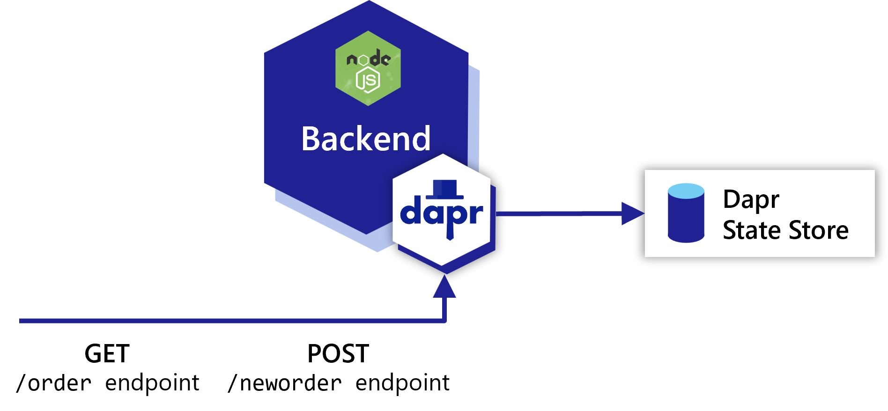
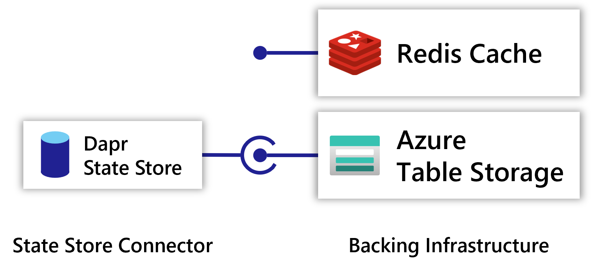

In this tutorial you will be deploying an online store where you can order items:

#### (optional) Download the source code

You can view and download the source code in the [samples repo](https://github.com/project-radius/samples). For access fill out [this form](https://aka.ms/ProjectRadius/GitHubAccess).

## Containers

This Radius application will have two [containers]():

- A UI for users to place orders written with .NET Blazor (`frontend`)
- A backend order processing microservice written in Node.JS (`backend`)

### `frontend` container

The user-facing UI app (`frontend`) offers a portal for users to place orders. Upon creating an order, `frontend` uses [Dapr service invocation](https://docs.dapr.io/developing-applications/building-blocks/service-invocation/service-invocation-overview/) to send requests to `nodeapp`.

The `frontend` container is configured with a [Dapr sidecar extension]() to add the sidecar container.

### `backend` container

The order processing microservice (`backend`) accepts HTTP requests to create or display orders. It accepts HTTP requests on two endpoints: `GET /order` and `POST /neworder`.

The `backend` container is configured with a [Dapr sidecar extension]() to add the sidecar container, along with a [Dapr Route](#routes) to model Dapr communication.

## Connector

A [Dapr statestore connector]() is used to model and deploy the Dapr statestore component. This tutorial will use:

- A Dapr state store used to store the orders (`statestore`)

### `statestore` Dapr state store

The [Dapr state store]() resource (`statestore`) stores information about orders. It could be any compatible [Dapr state store](https://docs.dapr.io/developing-applications/building-blocks/state-management/state-management-overview/).

The Dapr component configuration is automatically generated for the statestore based on the values provided in the app model.

## Routes

Radius offers communication between services via [Routes]().

### Dapr service invocation

In this tutorial we will be using a [Dapr HTTP invoke route]() resource to model communication from `frontend` to `backend`. This allows `frontend` to use Dapr service invocation to interact with `backend`.

## Summary

In this tutorial, you will learn how Project Radius offers:

- Compute services, such as a container, to model your running code
- Relationships between resources that are fully specified with protocols and other strongly-typed information
- Connector and Route resources for [Dapr building blocks]()
- Automatically generated Dapr component configuration

 
