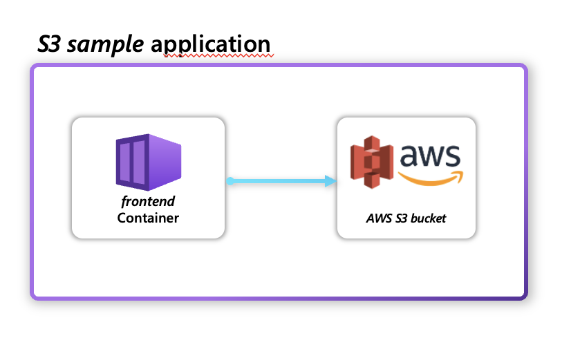
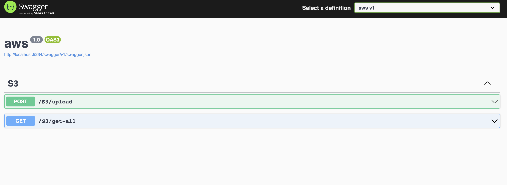

This quickstart will show you:

- How to model an AWS S3 resource in Bicep
- How to use a sample application to interact with AWS S3 bucket

   

## Prerequisites

- Make sure you have an [AWS account](https://aws.amazon.com/premiumsupport/knowledge-center/create-and-activate-aws-account) and an [IAM user](https://docs.aws.amazon.com/IAM/latest/UserGuide/getting-started_create-admin-group.html)
    - [Create an IAM AWS access key](https://docs.aws.amazon.com/IAM/latest/UserGuide/id_credentials_access-keys.html) and copy the AWS Access Key ID and the AWS Secret Access Key to a secure location for use later. If you have already created an Access Key pair, you can use that instead.
- [AWS CLI](https://docs.aws.amazon.com/cli/latest/userguide/getting-started-install.html)
    - Configure your CLI with [`aws configure`](https://docs.aws.amazon.com/cli/latest/reference/configure/index.html), specifying your configuration values
- [eksctl CLI](https://docs.aws.amazon.com/eks/latest/userguide/eksctl.html)
- [kubectl CLI](https://kubernetes.io/docs/tasks/tools/install-kubectl/)  

## Step 1: Create an EKS Cluster

Create an EKS cluster by using the `eksctl` CLI. 

```bash
eksctl create cluster --name <my-cluster> --region=<my-region> 
```

## Step 2: Create a Radius environment with the AWS cloud provider

Create a [Radius environment]() where you will deploy your application.

1. Use the `rad init` command to initialize a new environment into your current kubectl context:

   ```bash
   rad init
   ```

   Follow the prompts to install the [control plane services](), create an [environment resource](), and create a [local workspace](). You will be asked for:

   - **Namespace** - When an application is deployed, this is the namespace where your containers and other Kubernetes resources will be run. By default, this will be in the `default` namespace.
   {} When you initialize a Radius Kubernetes environment, Radius installs the control plane resources within    the `radius-system` namespace in your cluster, separate from your applications. The namespace specified in this step will be used for your application deployments.
   {}
   -  **Add AWS provider** - An [AWS cloud provider]() allows you to deploy and manage AWS resources as part of your application. Enter 'y' and follow the instructions. Provide a valid AWS region and the values obtained for IAM Access Key ID and IAM Secret Access Keys.
   - **Environment name** - The name of the environment to create. You can specify any name with lowercase letters, such as `myawsenv`.

## Step 3: Create a Bicep file to model AWS Simple Storage Service (S3)

Create a new file called `app.bicep` and add the following bicep code to model an AWS S3 Bucket:



Radius uses the [AWS Cloud Control API](https://docs.aws.amazon.com/cloudcontrolapi/latest/userguide/what-is-cloudcontrolapi.html) to interact with AWS resources. This means that you can model your AWS resources in Bicep and Radius will be able to deploy and manage them. You can find the list of supported AWS resources in the [AWS resource library]().

## Step 4: Add a Radius container to interact with the AWS S3 Bucket

Open the `app.bicep` and paste the following bicep code:



This creates a container that will be deployed to your Kubernetes cluster. The container will be able to interact with the AWS S3 Bucket you created in the previous step.

## Step 5: Create a separate IAM AWS access key for data plane operations

 Make sure to create a different [IAM AWS access key](https://docs.aws.amazon.com/IAM/latest/UserGuide/id_credentials_access-keys.html) for the container to connect to the S3 bucket. It is recommended to have separate credentials and intended to be used only by the containerized application.

## Step 6: Deploy the application

1. Deploy your application to your environment:

    ```bash
    rad deploy ./app.bicep -p aws_access_key_id=<AWS_ACCESS_KEY_ID> -p aws_secret_access_key=<AWS_SECRET_ACCESS_KEY>
    ```
    > Replace `<AWS_ACCESS_KEY_ID>` and `<AWS_SECRET_ACCESS_KEY>` with the values obtained from the previous step.

1. Port-forward the container to your machine with [`rad resource expose`]():

    ```bash
    rad resource expose containers frontend -a s3app --port 5234
    ```

1. Visit [localhost:5234](http://localhost:5234/swagger/index.html) in your browser. This is a swagger doc for the sample application. You can use this to interact with the AWS S3 Bucket you created. For example, you can try to upload a file to the bucket via the `/upload` endpoint.

    

## Step 5: Cleanup

1. When you're done with testing, you can use the rad CLI to [delete an environment]() to delete all Radius resources running on the EKS Cluster.

2. Cleanup AWS Resources - AWS resources are not deleted when deleting a Radius environment, so make sure to delete all resources created in this reference app to prevent additional charges. You can delete these resources in the AWS Console or via the AWS CLI. Instructions to delete an AWS S3 Bucket are available [here](https://docs.aws.amazon.com/AmazonS3/latest/userguide/delete-bucket.html).