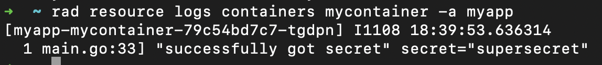

This quickstart will provide an overview of how to:

- Connect a container to an Azure resource using workload identity

## Prerequisites

- [rad CLI]()
- [Radius environment]()
- [Azure AD Workload Identity](https://azure.github.io/azure-workload-identity/docs/installation.html)
   - This quickstart is a Radius version of the [Azure AD workload identity quickstart](https://azure.github.io/azure-workload-identity/docs/quick-start.html) 

## Step 1: Run `rad env init kubernetes` 

Begin by running `rad env init kubernetes` and configuring an Azure cloud provider:

 ```bash
   rad env init kubernetes --environment default --provider-azure --provider-azure-resource-group <AZURE_RESOURCE_GROUP> --provider-azure-client-id <AZURE_CLIENT_ID> --provider-azure-client-secret <AZURE_CLIENT_SECRET> --provider-azure-tenant-id <AZURE_TENANT_ID> --provider-azure-subscription <AZURE_SUBSCRIPTION>
   ```

## Step 2: Define an app and a container

Create a file named `app.bicep` with a Radius application, [container](), and keyvault:



## Step 3: Deploy the app and container

1. Deploy your app by specifying the OIDC issuer URL. To retrieve the OIDC issuer URL, follow the Azure Workload Identity installation guide.

   ```bash
   rad deploy ./app.bicep -p oidcIssuer=<OIDC_ISSUER_URL>
   ```

## Step 4: Verify access to the keyvault

1. Once deployment completes, read the logs from your running container resource:

```bash
   rad resource logs containers mycontainers -a myapp
   ```

2. You should see the contents of the secret defined in your `app.bicep` file




## Cleanup

1. Run the following command to delete your app and container:

   ```bash
   rad app delete myapp --yes
   ```
