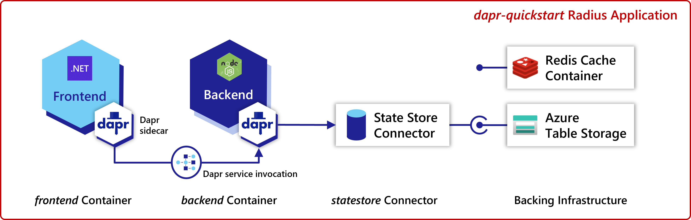
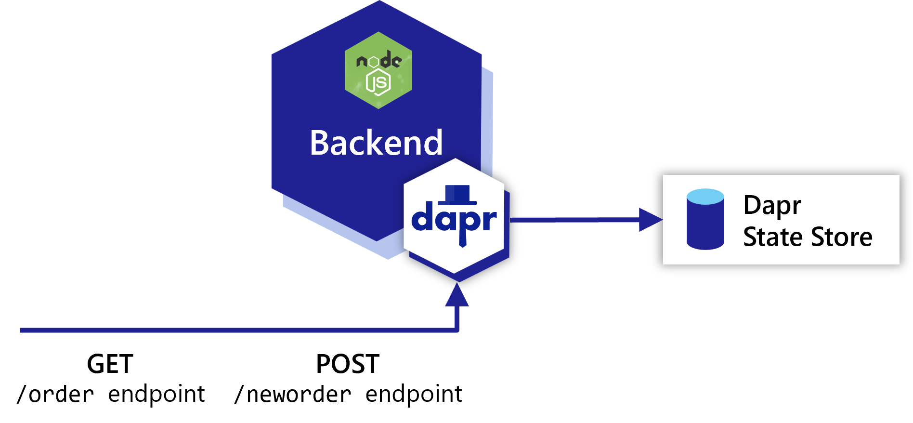
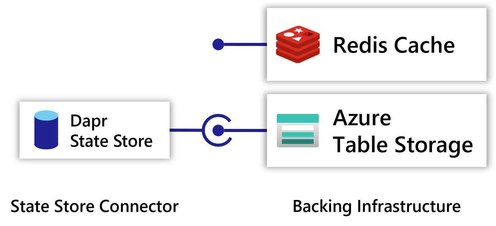

In this tutorial you will be deploying an online store where you can order items:

#### (optional) Download the source code

You can view and download the source code in the [samples repo](https://github.com/project-radius/samples).

> For access fill out [this form](https://aka.ms/ProjectRadius/GitHubAccess).

## Containers

This Radius application will have two [containers]():

- A frontend UI for users to place orders. Written with .NET Blazor.
- A backend order processing microservice. Written in Node.JS.

### `frontend` container

The user-facing UI app (`frontend`) offers a portal for users to place orders. Upon creating an order, `frontend` uses [Dapr service invocation](https://docs.dapr.io/developing-applications/building-blocks/service-invocation/service-invocation-overview/) to send requests to `nodeapp`.

The `frontend` container is configured with a [Dapr sidecar extension]() to add the sidecar container.

### `backend` container

The order processing microservice (`backend`) accepts HTTP requests to create or display orders. It accepts HTTP requests on two endpoints: `GET /order` and `POST /neworder`.

The `backend` container is configured with a [Dapr sidecar extension]() to add the sidecar container, along with an app ID to so it can be used with service invocation.

### Dapr service invocation

In this quickstart we will be using a [Dapr Service Invocation](https://docs.dapr.io/developing-applications/building-blocks/service-invocation/service-invocation-overview/) for communication from `frontend` to `backend`.

## Link

A [Dapr statestore link]() is used to model and deploy the Dapr statestore component.

### `statestore` Dapr state store

The [Dapr state store]() resource (`statestore`) stores information about orders. It could be any compatible [Dapr state store](https://docs.dapr.io/developing-applications/building-blocks/state-management/state-management-overview/).

The Dapr component configuration is automatically generated for the statestore based on the resource or values provided in the link definition.

#### Swappable infrastructure

In this quickstart you will be able to swap between different Dapr components, such as Azure Table Storage and a Redis container. While the backing infrastructure will change, the container definitions and connections will remain the same. This allows you to easily swap between different backing infrastructure without rewriting your service code or definition.

 
