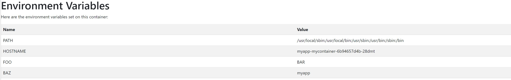
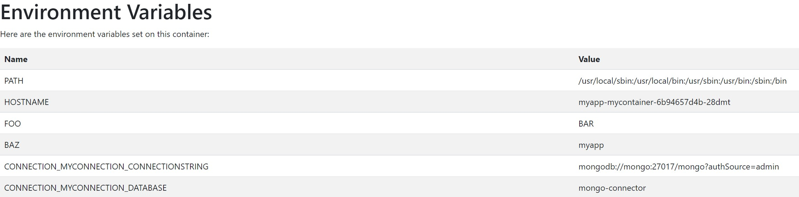

This quickstart will teach you:

1. How to set environment variables manually
1. How to set environment variables through connections

## Prerequisites

- [Radius CLI]()
- [Radius environment]()

## Step 1: Model an app and container

Create a new file named `app.bicep` and add the following code:



The image `radius.azurecr.io/quickstarts/envvars` simply prints out the environment variables that are set on the container.

## Step 2: Manually set environment variables

Add an `env` property which will contain a list of environment variables to set. Within `env` set the `FOO` environment variable to `bar` and the `BAZ` environment variable to `app.name`.
   


## Step 3: Deploy your app

1. Deploy your application to your environment:

   ```bash
   rad deploy ./app.bicep
   ```
1. Port-forward the container to your machine:

    ```bash
    rad resource expose containers mycontainer -a myapp --port 5000
    ```
1. Visit [localhost:5000](http://localhost:5000) in your browser. You should see the following page:

   

## Step 4: Add a Mongo Connector

Next, add to `app.bicep` a module with a containerized Mongo database (leveraging a Bicep module containing Kubernetes resources), along with a Mongo connector:



## Step 5: Connect to the Mongo Connector

Update your container definition to add a connection to the new Mongo connector:



## Step 6: Deploy your app

1. Deploy your application to your environment:

   ```bash
   rad deploy ./app.bicep
   ```
1. Port-forward the container to your machine:

    ```bash
    rad resource expose containers mycontainer -a myapp --port 5000
    ```
1. Visit [localhost:5000](http://localhost:5000) in your browser. You should see the following page, now showing injected environment variables:

   

## Cleanup

1. Run `rad app delete` to cleanup your Radius application, container, and connector:

   ```bash
   rad app delete -a myapp
   ```
1. Delete the Mongo Kubernetes resources:

   ```bash
   kubectl delete statefulset,serviceaccount,clusterrolebinding,clusterrole,secret mongo
   kubectl delete pvc db-storage-claim-mongo-0
   ```
