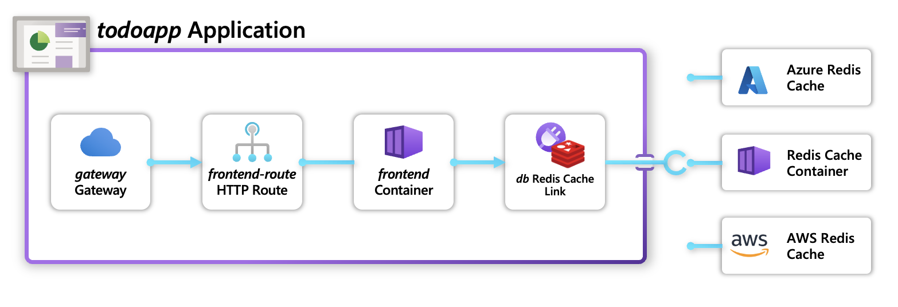
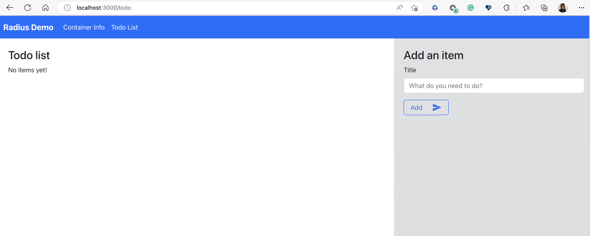

This quickstart will teach you:

* How to use “dev” Recipes in your Radius Environment
* How to deploy your own Recipes in your Radius Environment for Azure.

## Prerequisites

- Install the [rad CLI]()
- A supported [Kubernetes cluster]()

## Overview

[Recipes]() enable a separation of concerns between infrastructure teams and developers by automating infrastructure deployment. Developers define _what_ they need (_Redis, Mongo, etc._), and operators define _how_ it will be deployed (_Azure/AWS/Kubernetes infrastructure_).



## Application overview

This application is a simple to-do list which stores and visualized to-do items. It consists of a frontend [container]() and a backend [Redis Link]():



## Step 1: Initialize a Radius environment

1. Begin in a new directory for your application:
   ```bash
   mkdir recipes
   cd recipes
   ```
2. Initialize a new dev environment, which is pre-loaded with lightweight dev Recipes:
   ```bash
   rad init --dev
   ```
   > **Note**: Do not allow Radius to setup an application in the current directory 

   [`dev` Recipes]() provide a set of Recipes that allow you to quickly get up and running with lightweight containerized infrastructure.
   3. Use [`rad recipe list`]() to view the Recipes in your dev environment:

   ```bash
   rad recipe list 
   ```

   You should see a table of available Recipes (_with more to be added soon_):
   ```bash
   NAME          TYPE                              TEMPLATE
   default       Applications.Link/redisCaches     radius.azurecr.io/recipes/dev/rediscaches:v0.21

## Step 2: Deploy your application

1. Create a Bicep file `app.bicep` with the following content:



2. Use the `rad deploy` command to deploy your application:

   ```bash
   rad deploy ./app.bicep
   ```

   You should see the following logs:
   ```
   Building app.bicep...
   Deploying template 'app.bicep' into environment 'default' from workspace 'default'...

   Deployment In Progress...

   Completed            db              Applications.Link/redisCaches
   Completed            webapp          Applications.Core/applications
   Completed            frontend        Applications.Core/containers

   Deployment Complete

   Resources:
      webapp          Applications.Core/applications
      frontend        Applications.Core/containers
      db              Applications.Link/redisCaches
   ```


You've now deployed your application to your Kubernetes cluster!

3. List your Kubernetes Pods to see the infrastructure container deployed by the Recipe:

   ```bash
   kubectl get pods -n default-webapp
   ```

4. Port-forward the container to your machine with `rad resource expose`:

   ```bash
   rad resource expose containers frontend -a webapp --port 3000
   ```

5. Visit `localhost:3000` in your browser.

   You will now be able to see both the metadata of your container application as well as interact with the `Todo App` and add/remove items in it as wanted.

 
 
## Step 3: Use Azure recipes in your application

> *This step requires an Azure subscription to deploy cloud resources, which will incur costs. You will need to add the [Azure cloud provider]() to your environment in order to deploy Azure resources and leverage Azure Recipes.*




{}

1. Register the Recipe to your Radius Environment:

   ```bash
   rad recipe register azure --environment default --template-kind bicep --template-path radius.azurecr.io/recipes/azure/rediscaches:0.21 --link-type Applications.Link/redisCaches 
   ```

2. Update your resource to use the `azure` Recipe

   ```bash
   // Redis Cache Link resource that utilizes a `azure` Recipe
   resource db 'Applications.Link/redisCaches@2022-03-15-privatepreview' = {
      name: 'db'
      location: location
      properties: {
         environment: environment
         application: app.id
         recipe: {
            name: 'azure'
         }
      }
   }
   ```

3. Deploy your application to your environment:

   ```bash
   rad deploy ./app.bicep 
   ```

   This operation may take some time, as the 'azure' Recipe is deploying an Azure Cache for Redis resource into your Azure subscription. It will then update your 'db' resource to use the Azure Redis. Once completed you should see the following resources deployed at the end of `rad deploy`:

   ```
   Building ./app.bicep...
   Deploying template './app.bicep' for application 'samples' and environment 'default' from workspace 'default'...

   Deployment In Progress... 

   Completed            webapp          Applications.Core/applications
   Completed            db              Applications.Link/redisCaches
   Completed            frontend        Applications.Core/containers

   Deployment Complete

   Resources:
      webapp          Applications.Core/applications
      frontend        Applications.Core/containers
      db              Applications.Link/redisCaches
   ```

{}


1. Port-forward the container to your machine with [`rad resource expose`]()

    ```bash
    rad resource expose containers frontend -a webapp --port 3000
    ```
1. Visit [localhost:3000](http://localhost:3000) in your browser. You should see a page like

   

   You can play around with the application's features:

   - Add a todo item
   - Mark a todo item as complete
   - Delete a todo item

## Step 4: Cleanup your environment

1. If you're done with testing, you can use the rad CLI to [delete an environment]() to delete all Radius resources running on your cluster.
2. Azure resources are not currently deleted when deleting a Radius environment. To prevent additional charges, make sure to delete the Azure Cache for Redis using the [Azure portal](https://portal.azure.com).

## Next steps

- To learn how to create your own custom Recipe visit our [administrator guide]()
