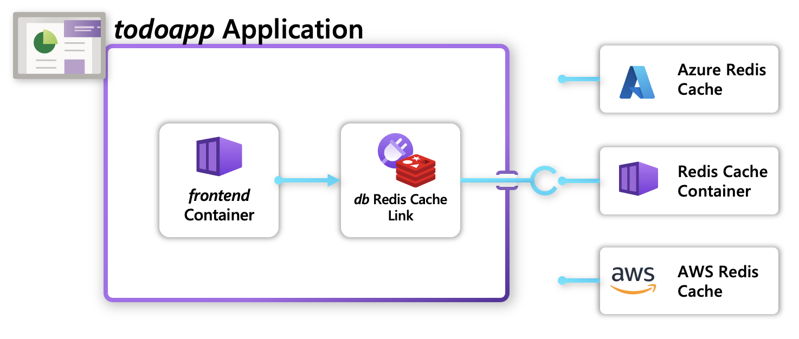

This quickstart will teach you:

* How to use “dev” Recipes in your Radius Environment
* How to deploy your own Recipes in your Radius Environment for multiple cloud providers.
* How to author your own Recipes

## Prerequisites

- Install the [rad CLI]()
- A supported [Kubernetes cluster]()

## Overview

[Recipes]() enable a separation of concerns between infrastructure teams and developers by automating infrastructure deployment. Developers define _what_ they need (_Redis, Mongo, etc._), and operators define _how_ it will be deployed (_Azure/AWS/Kubernetes infrastructure_).



## Application overview

This application is a simple to-do list which stores and visualized to-do items. It consists of a frontend [container]() and a backend [Redis Link]():



## Step 1: Initialize a Radius environment

Navigate to the directory where you want to create your application and run the following command:

1. Begin in a new directory for your application:
   ```bash
   mkdir recipes
   cd recipes
   ```
2. Initialize a new environment with [`dev` Recipes]():
   ```bash
   rad init --dev
   ```

### `dev` Recipes

[`dev` Recipes]() allow you to quickly get up and running with infrastructure for your [Links](). You can view this with [`rad recipe list`]():

```bash
rad recipe list 
```

You should see a table of available Recipes (_with more to be added soon_):
```
NAME              TYPE                              TEMPLATE
redis-aws         Applications.Link/redisCaches     radius.azurecr.io/recipes/rediscaches/aws:1.0
redis-kubernetes  Applications.Link/redisCaches     radius.azurecr.io/recipes/rediscaches/kubernetes:1.0
redis-azure       Applications.Link/redisCaches     radius.azurecr.io/recipes/rediscaches/azure:1.0
```

## Step 2: Deploy your application

1. Create a Bicep file `app.bicep` with the following content:



2. Use the `rad deploy` command to deploy your application:

   ```bash
   rad deploy ./app.bicep
   ```

   You should see the following logs:
   ```bash
   Building app.bicep...
   Deploying template 'app.bicep' into environment 'default' from workspace 'default'...

   Deployment In Progress...

   Completed            db              Applications.Link/redisCaches
   Completed            webapp          Applications.Core/applications
   Completed            frontend        Applications.Core/containers

   Deployment Complete

   Resources:
      webapp          Applications.Core/applications
      frontend        Applications.Core/containers
      db              Applications.Link/redisCaches
   ```


You've now deployed your application to your Kubernetes cluster!

## Step 3: Use Azure / AWS recipes in your application
> *This step needs an Azure subscription or an AWS account to deploy the application which would incur some costs. Add the required cloud provider (AWS/Azure) to your environment in order to deploy an Azure or AWS recipe*




{}

Update the recipe name to `redis-azure` to use the Redis Cache container.

1. Deploy your application to your environment:

   ```bash
   rad deploy ./app.bicep 
   ```

   This will deploy the application into your environment and launch the container resource for the frontend website. This operation may take some time, since it is deploying a Redis Cache resource to Azure. You should see the following resources deployed at the end of `rad deploy`:

   ```

   ```

{}

{}

Update the recipe name to `redis-aws` to use the Amazon MemoryDB for Redis.

> *You can run this only on an EKS cluster. Make sure that the each of the Subnets in your EKS cluster Subnet Group are within the [list of supported MemoryDB availability zones](https://docs.aws.amazon.com/memorydb/latest/devguide/subnetgroups.html)*

1. Deploy your application to your environment:

   ```bash
   rad deploy ./app.bicep --parameters eksClusterName=YOUR_EKS_CLUSTER_NAME
   ```

   Make sure to replace `YOUR_EKS_CLUSTER_NAME` with your EKS cluster name.

   This will deploy the application into your environment and launch the container resource for the frontend website. This operation may take some time, since it is deploying a MemoryDB resource to AWS. You should see the following resources deployed at the end of `rad deploy`:

   ```
   Deployment In Progress...

   Completed            memorydb-module Microsoft.Resources/deployments
   Completed            webapp          Applications.Core/applications
   Completed            demo-memorydb-subnet-group AWS.MemoryDB/SubnetGroup
   Completed            demo-memorydb-cluster AWS.MemoryDB/Cluster
   Completed            <YOUR_EKS_CLUSTER_NAME> AWS.EKS/Cluster     
   Completed            demo-memorydb-cluster AWS.MemoryDB/Cluster
   Completed            db              Applications.Link/redisCaches
   Completed            frontend        Applications.Core/containers

   Deployment Complete

   Resources:
      <YOUR_EKS_CLUSTER_NAME> AWS.EKS/Cluster     
      demo-memorydb-cluster AWS.MemoryDB/Cluster
      demo-memorydb-subnet-group AWS.MemoryDB/SubnetGroup
      db              Applications.Link/redisCaches
      webapp          Applications.Core/applications
      frontend        Applications.Core/containers
   ```  
{}


## Next steps
- To learn how to create your own custom Recipe visit our [administrator guide]()
