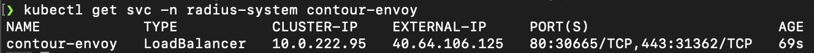
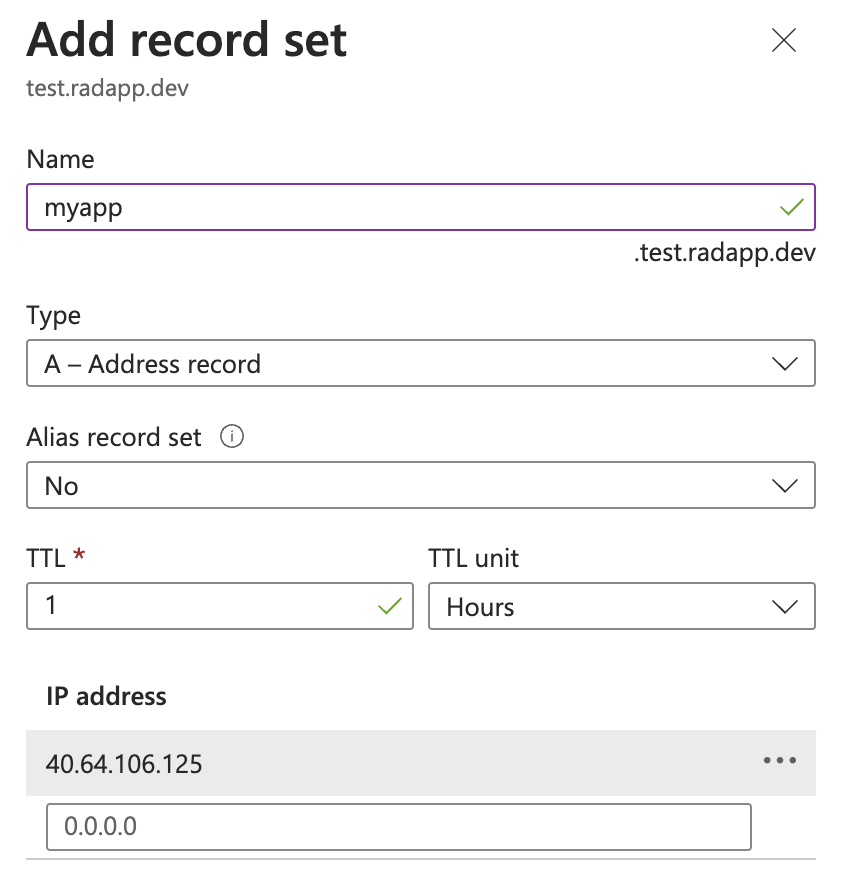
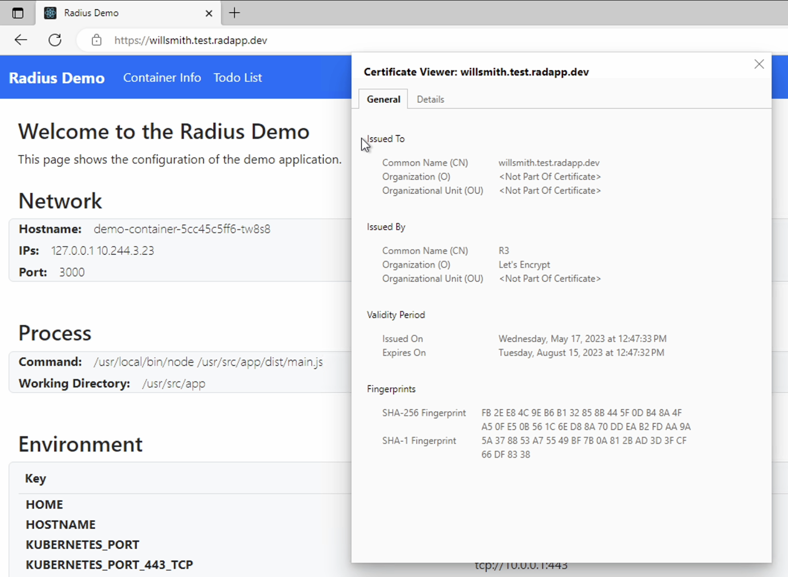

This quickstart will show you:

- How to integrate Radius with cert-manager and Let's Encrypt in order to enable HTTPS for your app

## Prerequisites

- [rad CLI]()
- [AKS Cluster]()
- [kubectl CLI](https://kubernetes.io/docs/tasks/tools/)
- A domain on [Azure DNS](https://azure.microsoft.com/en-us/products/dns)
- [az CLI](https://learn.microsoft.com/en-us/cli/azure/)
- [jq CLI](https://jqlang.github.io/jq/)


## Step 1: Initialize a Radius environment

Begin by running `rad install kubernetes` and `rad init`. This will tell Radius which domain name your application will be accessed by.

```sh
rad init
```


## Step 2: Set up domain

1. Run the following command and copy the EXTERNAL-IP field:


1. In the Azure DNS zone, press the [+ Record set] button to add an A record and add your IP address from above in the list of IP addresses.



## Step 3: Install cert-manager

Next, run the following command to install [cert-manager](https://cert-manager.io/):
```sh
kubectl apply -f https://github.com/jetstack/cert-manager/releases/download/v1.5.4/cert-manager.yaml
```


## Step 4: Set up DNS01 Challenge

Follow the [cert-manager guide](https://cert-manager.io/docs/configuration/acme/dns01/azuredns/#service-principal) for setting up the AzureDNS DNS01 Challenge for a Kubernetes cluster using an Azure Service Principal.

At the end of this process, you should have a Secret resource called `azuredns-config` as well as a ClusterIssuer resource. Here is what your ClusterIssuer resource should look like:



> Note that this guide shows how to set up a certificate using Let's Encrypt prod. For testing purposes, you can change this to the [staging endpoint](https://letsencrypt.org/docs/staging-environment/).


## Step 5: Create Certificate resource

Create a file `certificate.yaml` with the following data, replacing the placeholders as necessary:



Also create `tls-delegation.yaml` with the following data.



Run the following commands to create the certificate resource and authorize Radius to access the resource:

```sh
kubectl apply -f certificate.yaml
kubectl apply -f tls-delegation.yaml
```

You may need to wait a minute or two for cert-manager to authorize with Let's Encrypt and create the secret on the cluster. Once this process completes, you should see a secret called `demo-secret` in the default namespace. This secret is managed by cert-manager.


## Step 6: Define the Radius application

Create a file named `app.bicep`. Here, we reference the `demo-secret` and reference the Secret Store in the Gateway to enable TLS termination.




## Step 7: Deploy the application

```sh
rad deploy app.bicep
```

Once the deployment is complete, you should see a public endpoint displayed at the end. Navigating to this public endpoint should show you your application that is accessed via HTTPS and has a Let's Encrypt certificate enable TLS Termination on the Radius Gateway.


