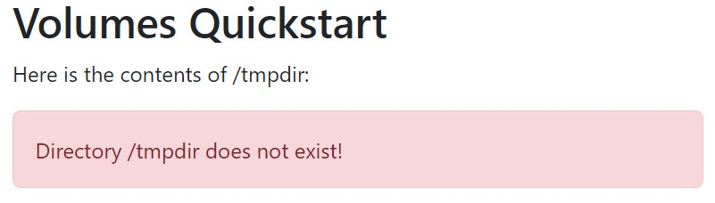

This quickstart will provide an overview of how to:

- Mount an ephemeral (short-lived) volume to a container

## Prerequisites

- [rad CLI]()
- [Radius environment]()

## Step 1: Define an app and a container

Begin by creating a file named `app.bicep` with a Radius application and [container]():



The `quickstarts/volume` container will display the status and contents of the `/tmp` directory within the container.

## Step 2: Deploy the app and container

1. Deploy your app with the command:

   ```bash
   rad deploy ./app.bicep
   ```
1. Once complete, port forward to your container with [`rad resource expose`]():

   ```bash
   rad resource expose containers mycontainer -a myapp --port 5000
   ```
1. You should see a message warning that the directory `/tmp` does not exist:

   

## Step 3: Add an ephemeral volume

Within the `container.volume` property, add a new volume named `tmp` and configure it as a memory-backed ephemeral volume:



## Redeploy your app and container

1. Redeploy your application to apply the new definition of your container:

   ```bash
   rad deploy ./app.bicep
   ```

1. Once complete, port forward to your container with [`rad resource expose`]():

   ```bash
   rad resource expose containers mycontainer -a myapp --port 5000
   ```
1. You should see the contents of `/tmp`, showing an empty directory.

   
1. Press the `Add File` button to generate a new file in the directory
1. Done! You've now learned how to mount an ephemeral volume

## Cleanup

1. Run the following command to delete your app and container:

   ```bash
   rad app delete myapp
   ```
