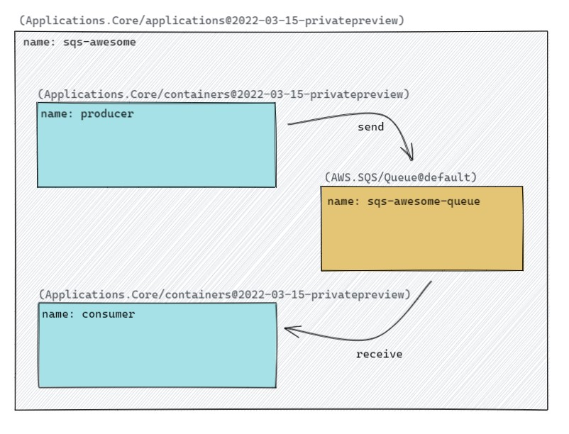

This reference app will show you:

* How to model AWS SQS resources in Bicep
* How to use a sample application to interact with AWS SQS Queues

## Prerequisites

- [Complete the getting started guide for AWS up to Step 2]()

## Step 1: Create a Bicep file which uses AWS Simple Queue Service (SQS)

Create a new file called `app.bicep` and add the following bicep code:



This application models two http services: (1) `producer` and (2) `consumer` that run as containers that communicate via a queue as shown in the diagram below



## Step 2: Deploy the application

1. Deploy your application to your environment:

    ```bash
    rad deploy ./app.bicep -p aws_access_key_id=$AWS_ACCESS_KEY_ID -p aws_secret_access_key=$AWS_SECRET_ACCESS_KEY -p aws_region=$AWS_REGION -p queue_name='queue'
    ```

    The access key, secret key, and region can be the same values you used in the [AWS Quickstart](). These are used so the container we are deploying can connect to AWS. The AWS SQS Queue name must follow the [`Queue name` conventions](https://docs.aws.amazon.com/AWSSimpleQueueService/latest/SQSDeveloperGuide/quotas-queues.html).

1. Port-forward the container to your machine with [`rad resource expose`]():

    ```bash
    rad resource expose containers producer -a sqs-sample --port 3000 &
    rad resource expose containers producer -a sqs-sample --port 4000 &
    ```

1. Visit [localhost:3000/send](http://localhost:3000/send) in your browser, this will send a message to the SQS Queue provisioned in `app.bicep`. 

1. Visit [localhost:4000/receive](http://localhost:3000/send) in your browser, this will consume the SQS Queue message and display its contents.

## Cleanup

{}
If you're done with testing, you can use the rad CLI to [delete an environment]() to delete all Radius resources running on the EKS Cluster.
{}

{}
AWS resources are not deleted when deleting a Radius environment, so to prevent additional charges, make sure to delete all resources created in this reference app. You can delete these resources in the AWS Console or via the AWS CLI. To delete the AWS SQS Queue, see https://docs.aws.amazon.com/AWSSimpleQueueService/latest/SQSDeveloperGuide/step-delete-queue.html.
{}