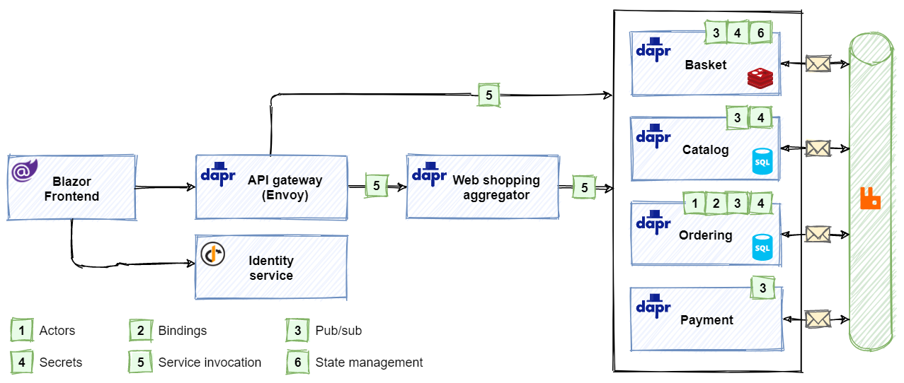

## Background

The [eShop on Dapr](https://github.com/dotnet-architecture/eShopOnDapr) reference application is a sample .NET Core distributed application based on [eShopOnContainers](https://github.com/dotnet-architecture/eShopOnContainers), powered by [Dapr](https://dapr.io).

### Architecture

 

As the focus of the eShopOnDapr reference application is on Dapr, the original application has been updated. The updated architecture consists of:

- A frontend web-app written in [Blazor](https://dotnet.microsoft.com/apps/aspnet/web-apps/blazor). It sends user requests to an API gateway microservice.
- The API gateway abstracts the backend core microservices from the frontend client. It's implemented using [Envoy](https://www.envoyproxy.io/), a high performant, open-source service proxy. Envoy routes  incoming requests to various backend microservices. Most requests are simple CRUD operations (for example, get the list of brands from the catalog) and handled by a direct call to a backend microservice.
- Other requests are logically more complex and require multiple microservices to work together. For these cases, eShopOnDapr implements an aggregator microservice that orchestrates a workflow across the microservices needed to complete the operation.
- The set of core backend microservices includes functionality required for an eCommerce store. Each is self-contained and independent of the others. Following widely accepted domain decomposing patterns, each microservice isolates a specific *business capability*:
  - The basket service manages the customer's shopping basket experience.
  - The catalog service manages product items available for sale.
  - The identity service manages authentication and identity.
  - The ordering service handles all aspects of placing and managing orders.
  - The payment service transacts the customer's payment.
- Finally, the event bus enables asynchronous publish/subscribe messaging across microservices. Developers can plug in any Dapr-supported message broker.

## Adding Radius

With Dapr, you get code-level portability across different cloud + edge platforms. Adding in Project Radius, you can now describe all of your services and infrastructure as a unified application, and gain full code + infrastructure portability across cloud + edge platforms.

Project Radius allows the eShop on Dapr application to:

- Define the entire collection of microservices and backing infrastructure as a single application in a single language. No more separate templating languages and scripts to glue it all together.
- Easily manage configuration and credentials between infrastructure and services, all within the app model. No more manually copying/pasting connection strings or secrets.
- Simplify deployment with Bicep and Azure Resource Manager (ARM). No more custom deployment scripts or workflows.



*Visit the [GitHub docs]() if you need access to the organization*