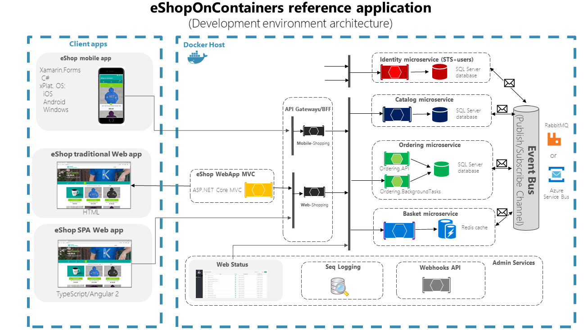
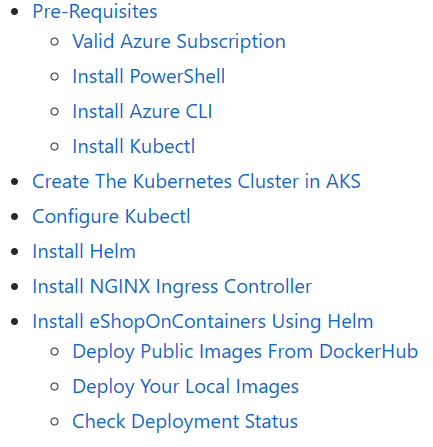

{}
The following sample is a preview of how eShop can be deployed with Radius. As we introduce additional features to Radius we will incorporate them into this demo. In the meantime, there are some rough edges we have temporary workarounds for.
{}

## Background

The [eShop on Containers](https://github.com/dotnet-architecture/eShopOnContainers) reference application is a sample .NET Core microservices application. It contains 15 services plus additional containers or cloud services for infrastructure such as SQL, Redis, Mongo, and either RabbitMQ or Service Bus.

### Architecture

 

From the [eShop repo](https://github.com/dotnet-architecture/eShopOnContainers#architecture-overview):

> eShop on Containers uses a microservice oriented architecture implementation with multiple autonomous microservices (each one owning its own data/db) and implementing different approaches within each microservice (simple CRUD vs. DDD/CQRS patterns). The application uses HTTP as the communication protocol between the client apps and the microservices and supports asynchronous communication for data updates propagation across multiple services based on Integration Events and an Event Bus.

### Deployment today

[Deploying eShop without Project Radius](https://github.com/dotnet-architecture/eShopOnContainers/tree/dev/deploy/k8s) requires deploying a cluster and the backing infrastructure, configuring multiple CLIs and tools, running deployment scripts, and manually copying/pasting credentials and endpoints.
> 

eShop provides instructions to [deploy to Azure](https://github.com/dotnet-architecture/eShopOnContainers/wiki/Deploying-Azure-resources) or to [deploy to an AKS cluster](https://github.com/dotnet-architecture/eShopOnContainers/wiki/Deploy-to-Azure-Kubernetes-Service-(AKS)) (and even to [deploy to AKS using ARM/Bicep templates](https://github.com/Azure/bicep/tree/main/docs/examples/101/aks)).  
Once the cluster and infrastructure resources are deployed, you can [deploy the eShop application using Helm charts and PowerShell](https://github.com/dotnet-architecture/eShopOnContainers/wiki/Deploy-to-Azure-Kubernetes-Service-(AKS)#install-eshoponcontainers-using-helm).

## Adding Radius

Adding Project Radius to the eShop on containers application allows teams to:

- Define the entire collection of microservices and backing infrastructure as a single application
- Easily manage configuration and credentials between infrastructure and services, all within the app model
- Simplify deployment with Bicep and Azure Resource Manager (ARM)



*Visit the [GitHub docs]() if you need access to the organization*