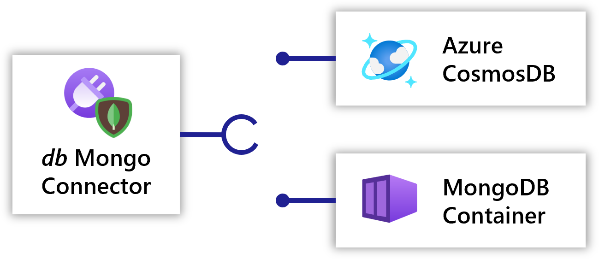

## Download the source code



{}
Download and unzip `tutorial.zip`:

{}

{}
In the [preconfigured Codespace]() you can `cd` into the `tutorial` directory:
```bash
cd tutorial
```
{}



The tutorial directory contains three files:

1. **app.bicep** - Contains the app definition
1. **mongo-container.bicep** - Contains the definition for deploying mongo container
1. **azure-cosmosdb.bicep** - Contains the definition for Azure cosmosdb

## Application

Let's dig into the `app.bicep` to understand the input parameters and `Applications.Core/applications` resource:



Within the application resource, the **environment** property specifies the environmentId to deploy the application and other resources into. Since this was initialized in the previous step via the CLI, `rad deploy` will automatically inject the `environment` parameter into the Bicep file during deployment.

The **location** property defines where to deploy a resource within the targeted platform. For self-hosted Kubernetes environments this value must be set to `'global'`. See [Resource Schema]() for more info.

## Container and route

Next, lets look into the definition for the website's frontend container.

Radius captures the relationships and intentions behind an application, which simplifies deployment and management. The `frontend` and `frontend-route` resources in your Bicep file will contain everything needed for the website frontend to run and expose a port to the internet.

The **`frontend`** [container]() resource specifies:

- **application**: The application to which this container belongs. The ID of the application defined above is used.
- **container image**: The container image to run. This is where your website's front end code lives.
- **container ports**: The ports to expose on the container, along with the [HttpRoute]() that will be used to access the container.
- **connections**: The connections to make to other resources. In this case, the frontend container will connect to the backing database. This is described further in the next paragraph.



## Gateway

A **`gateway`** [Gateway]() is how users will interact with your frontend container. The gateway resource specifies:

- **application**: The application to which this gateway belongs. The ID of the application defined above is used.
- **routes**: The routes handled by this gateway. Here, we specify that `'/'` should map to `frontend-route`, which is provided by the `frontend` container.



## Connectors

A [Radius connector]() provides an abstraction for an infrastructure resource through its API, allowing the backing resource type to be swapped out without changing the way the consuming resource is defined. In this example, a developer can first use a containerized Mongo DB as the app's database when deploying to their dev environment. Later, the infrastructure admin can use an Azure CosmosDB w/ Mongo API as the app's database when deploying to production.

<br />

To learn more about connectors visit the [concepts docs]().

### Containerized Mongo DB

Let's look at a Mongo DB backed by a Mongo Kubernetes StatefulSet and Service within `mongo-container.bicep`:

{{< rad file="snippets/mongo-container.bicep" embed=true marker="//MONGO" replace-key-ss="//SS" replace-value-ss="resource statefulset 'apps/StatefulSet@v1' = {...}" replace-key-service="//SERVICE" replace-value-service="resource service 'core/Service@v1' = {...}" >}}

The mongo container definition is then referenced within `app.bicep` as a [Bicep module](https://docs.microsoft.com/azure/azure-resource-manager/bicep/modules):



### Mongo connector

Now that you have modeled your infrastructure, look how the `Applications.Connector/mongoDatabases` connector is built using the `connectionString` output:



### Connect to `db` from `frontend`

Once the `db` connector is defined, you can reference it in the [`connections`]() section of the `frontend` resource, as shown above.

[Connections]() are used to configure relationships between the source container and the target resource. This declares the *intention* from the `frontend` container to communicate with the `db` resource.

Now that you have created a connection called `itemstore`, environment variables with connection information will be injected into the `frontend` container. The container reads the database connection string from an environment variable named `CONNECTION_ITEMSTORE_CONNECTIONSTRING`.

{}
Connections automatically inject connection data into containers as environment variables. The name of the environment variable is the connection name in all caps, prefixed with `CONNECTION_`. For example, the connection named `itemstore` will inject the variable `CONNECTION_ITEMSTORE_CONNECTIONSTRING` with the connection string from `db`. Learn more in the [connections docs]().
{}

## Deploy the application

Now you are ready to deploy the application for the first time:

1. Make sure you have an [Radius environment initialized]().

1. Deploy to your Radius environment via the rad CLI:

   ```sh
   rad deploy ./app.bicep
   ```

   This will deploy the application into your environment and launch the container resource for the frontend website. You should see the following resources deployed at the end of `rad deploy`:

   ```
   Deployment In Progress:

     Completed       webapp                     Applications.Core/applications
     Completed       frontend                   Applications.Core/containers
     Completed       http-route                 Applications.Core/httpRoutes
     Completed       public                     Applications.Core/gateways
     Completed       mongo-module               Microsoft.Resources/deployments
     Completed       db                         Applications.Connector/mongoDatabases

   Deployment Complete 
   ```
1. List the resources in your application using ['rad resource list`]():
   ```bash
   rad resource list -a webapp
   ```
   ```
   RESOURCE    TYPE
   db          applications.connector/mongodatabases
   public      applications.core/gateways
   http-route  applications.core/httproutes
   frontend    applications.core/containers
   ```
1. Get the public endpoint address for the gateway:

   A public endpoint will also be available to your application from the [Gateway]() resource. Use [`rad app status`]() to get the endpoint:
   ```bash
   rad app status -a webapp
   ```

3. To test your application, navigate to the public endpoint:

   

   {}
   If you are unable to connect to webapp in your browser, make sure your organization does not block HTTP traffic to your Kubernetes cluster. You may need to be on your corporate network or use a jumpbox. As a workaround, you can run `rad resource expose containers frontend -a webapp --port 3000` to port-forward the frontend container to your local machine. Then, you can access the application at `http://localhost:3000`.
   {}

   You can play around with the application's features:

   - Add a todo item
   - Mark a todo item as complete
   - Delete a todo item

## Next step: Moving to production on Azure

This step has shown how a developer can test the application with a Mongo container. When moving to production, the dev may now want to handoff the deployment to the operations team for deployments to other environments. The operator can now setup a Radius environment with Azure cloud provider and use the same app, but now connect it to an Azure CosmosDB using the Mongo connector. The next step will show how the connector can be updated to use a CosmosDB instead of a Mongo container:

<br>  
