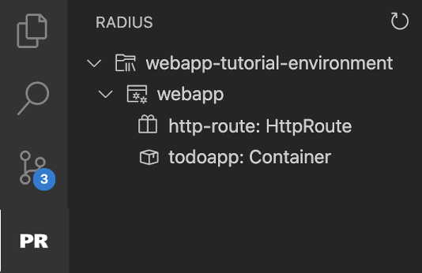

As a developer, you define the building blocks of your application. In this step, you will create the application template with the services required by the frontend of the application.

## Define a Radius application in a .bicep file

Radius uses the [Bicep language]() as its file-format and structure. In this tutorial you will define an app named `todoapp` that will contain the container and MongoDB connector resources, all described in Bicep.

Create a new file named `app.bicep` and paste the following to add a radius application 



The environment property depicts the environment that was initialized in the previous step for the app to land on.

## Add a container component

Next you'll add resources for the website's frontend.

Radius captures the relationships and intentions behind an application, which simplifies deployment and management. The `frontend` and `frontend-route` resources in your Bicep file will contain everything needed for the website frontend to run and expose a port to the internet.

The **`frontend`** [container]() resource specifies:

- `container image`: The container image to run. This is where your website's front end code lives
- `ports`: The port to expose on the container, along with the [HttpRoute]() that will be used to access the container

The **`gateway`** [Gateway]() resource specifies:

- `routes`: The routes handled by this gateway. Here, we specify that `'/'` should map to `frontend-route`, which is provided by the 'frontend' container.

Update your Bicep file to match the full application definition:



## Deploy the application

Now you are ready to deploy the application for the first time.

1. Make sure you have an [Radius environment initialized]().

2. Deploy to your Radius environment via the rad CLI:

   ```sh
   rad deploy ./app.bicep
   ```

   This will deploy the application into your environment and launch the container resource for the frontend website. You should see the following resources deployed at the end of `rad deploy`:

   ```sh
   Deployment In Progress:
   
     Completed       Application          Applications.Core/applications
     Completed       Container            Applications.Core/containers
     Completed       frontend-route       Applications.Core/httpRoutes
     Completed       gateway              Applications.Core/gateways
   
   Deployment Complete 
   ```

   Also, a public endpoint will be available to your application as we specified a [Gateway]().

   ```sh
   Public Endpoints:
      Gateway           frontend-gateway      IP-ADDRESS
   ```

3. To test your application, navigate to the public endpoint that was printed at the end of the deployment.

   {}
   If using a local environment, navigate to the IP address provided by `rad env status`. The address printed at deploy time currently points to the wrong endpoint.
   {}

   

   If the page you see matches the screenshot, that means the container is running as expected.

You can play around with the application's features:

- Add a todo item
- Mark a todo item as complete
- Delete a todo item

## Manage your application using the Radius VS Code extension

The Radius extension improves developer workflows. 

- In VS Code, select the "PR" (Project Radius) icon on the left to view the Radius extension.

   Environments you've created are listed in a tree view. By drilling into your "todoapp" application and its resources.

   

- Click on the `todoapp` resource node and click on the `Show Container Logs` to open view its logs.

<br>  