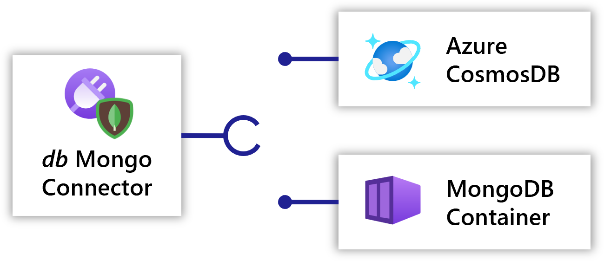

As a developer, you define the building blocks of your application. In this step, you will create the application template with the services required by the frontend of the application.

## Define a Radius application in a .bicep file

Radius uses the [Bicep language]() as its file-format and structure. In this tutorial you will define an app named `webapp` that will contain the container and MongoDB connector resources, all described in Bicep.

You can download the [source code and templates](https://get.radapp.dev/code/edge/tutorial.zip) which contains the source code of tutorial application and the Bicep templates. It contains three bicep files:

1. app.bicep - Contains the app definition
1. mongo-container.bicep - Contains the definition for deploying mongo container
1. azure-cosmosdb.bicep - Contains the definition for Azure cosmosdb

Lets dig into the `app.bicep` to understand the components. Below is the definition to add a Radius application



The environment property depicts the environment that was initialized in the previous step for the app to land on. Currently the environment property is auto-injected by Radius when the application is deployed.

The location property defines where to deploy a resource within the targeted platform. It is currently a required property that we expect to remove in a future release. See [Resource Schema]() for more info.

## Container

Next lets look into the definition for the website's frontend.

Radius captures the relationships and intentions behind an application, which simplifies deployment and management. The `frontend` and `frontend-route` resources in your Bicep file will contain everything needed for the website frontend to run and expose a port to the internet.

The **`frontend`** [container]() resource specifies:

- `container image`: The container image to run. This is where your website's front end code lives
- `ports`: The port to expose on the container, along with the [HttpRoute]() that will be used to access the container



The **`gateway`** [Gateway]() resource specifies:

- `routes`: The routes handled by this gateway. Here, we specify that `'/'` should map to `frontend-route`, which is provided by the 'frontend' container.



## Connectors

A [connector]() provides an infrastructure abstraction for an API, allowing the backing resource type to be swapped out without changing the way the consuming resource is defined. In this example, first a developer uses a Kubernetes resource (MongoDB) as the app's database when deploying to their dev environment. Later, the infrastructure admin uses a Azure resource (Azure CosmosDB) as the app's database when deploying to production.

<br />

To learn more about connectors visit the [concepts docs](

### Database connector

Lets look at the definition to add a Mongo database connector backed by a mongo container to your application

Below is the definition to add a mongo database connector



### Mongo container

The definition for the backing mongo container is provided by the `mongo-container.bicep` located in your tutorial source code directory. It contains the definition that is required to deploy the mongo container as a kubernetes resource.

The mongo container definition is then referenced as a module. You can learn more about bicep modules from [here](https://docs.microsoft.com/en-us/azure/azure-resource-manager/bicep/modules)



### Connect to `db` from `frontend`

Once the `db` connector is defined, you can reference it in the [`connections`]() section of the `frontend` resource:



[Connections]() are used to configure relationships between two components. The `db` is of kind `mongo.com/MongoDB`, which supports the MongoDB protocol. This declares the *intention* from the `frontend` container to communicate with the `db` resource.

Now that you have created a connection called `itemstore`, environment variables with connection information will be injected into the `frontend` container. The container reads the database connection string from an environment variable named `CONNECTION_ITEMSTORE_CONNECTIONSTRING`.

## App definition

Your app.bicep file should look like below



## Deploy the application

Now you are ready to deploy the application for the first time.

1. Make sure you have an [Radius environment initialized]().

2. Deploy to your Radius environment via the rad CLI:

   ```sh
   rad deploy ./app.bicep
   ```

   This will deploy the application into your environment and launch the container resource for the frontend website. You should see the following resources deployed at the end of `rad deploy`:

   ```sh
   Deployment In Progress:

     Completed       webapp                     Applications.Core/applications
     Completed       frontend                   Applications.Core/containers
     Completed       http-route                 Applications.Core/httpRoutes
     Completed       public                     Applications.Core/gateways
     Completed       mongo-module               Microsoft.Resources/deployments
     Completed       db                         Applications.Connector/mongoDatabases

   Deployment Complete 
   ```

   Also, a public endpoint will be available to your application since it contains a [Gateway]() resource.

   ```sh
   Public Endpoints:
      Gateway           frontend-gateway      IP-ADDRESS
   ```
   If you do not see a public endpoint, use `rad app status -a webapp` to get the endpoint
   ```sh
   APPLICATION  RESOURCES
   webapp       4

   GATEWAY   ENDPOINT
   public    IP-ADDRESS
   ```

3. To test your application, navigate to the public endpoint that was printed at the end of the deployment.

   

   {}
   If you are unable to connect to webapp in your browser, make sure your organization does not block http traffic to your Kubernetes cluster. You may need to be on your corporate network or use a jumpbox.
   {}

   If the page you see matches the screenshot, that means the container is running as expected.

   You can play around with the application's features:

   - Add a todo item
   - Mark a todo item as complete
   - Delete a todo item

## Handoff

This step closely relates to how the enterprises do hand-offs between different personas involved in the deployment. As a developer you have tested the application with a mongo container and would like to handoff the deployment to the infra-admin for deployments to other environments. The infra-admin can now set up a Radius environment with Azure cloud provider configured and can use the same app bicep template to provision an Azure resource via the connector. This ensures that you are able to port your application to different environments with minimal rewrites.

<br>  
