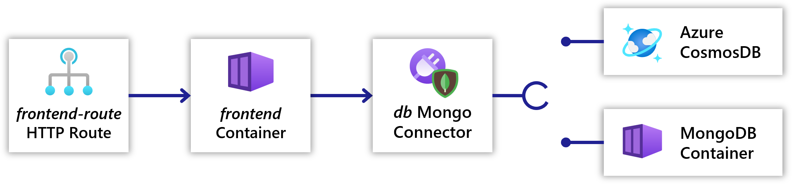

You will be deploying an application, `todoapp`, with the following resources:

1. [`frontend`](#frontend-container): A containerized to-do list frontend written in Node.JS
1. [`frontend-route`](#todoroute-httproute): An [HttpRoute]() that declares the connection to the frontend container
1. [`gateway`](#gateway-gateway): A [Gateway]() that exposes the application to the internet
1. [`db`](#db-connector): A [MongoDB connector]() to save to-do items in. Can be backed by either:
   - A MongoDB container
   - An Azure CosmosDB w/ Mongo API

## Resources

### `frontend` container

The example website is a single-page-application (SPA) with a Node.JS backend running in a [container](). The SPA sends HTTP requests to the Node.JS backend to read and store todo items.

The website listens on port 3000 for HTTP requests.

The website uses the MongoDB protocol to read and store data in a database. The website reads the environment variable `CONNECTION_ITEMSTORE_CONNECTIONSTRING` to discover the database connection string. If the connection string is not set the website will store the todo items in memory and not persist them.

#### (optional) Download the source code

You can view and download the source code in the [samples repo](https://github.com/project-radius/samples). For access fill out [this form](https://aka.ms/ProjectRadius/GitHubAccess).

### `frontend-route` HttpRoute

An [HttpRoute]() is used to define communication to the container app `frontend`.

### `gateway` Gateway

In order for users to connect to `todoapp` over the internet, a [Gateway]() is used to define the appropriate route paths.

### `db` Connector

The database is provided by a [MongoDB connector](). You can choose between a MongoDB container or an Azure CosmosDB w/ Mongo API to back the connector.

## The Radius mindset
Deployment often involves different teams working together, separating their responsibilities. For example, a developer might build the app definition with services, while the infrastructure administrator might set up the environment and the infrastructure. In this tutorial you will build the app from the perspective of a developer and an infrastructure administrator. 

As you progress, keep in mind the following benefits that the Radius application abstraction provides:

- Separation of concerns for the different personas involved in the deployment 
- Relationships between resources are fully specified with protocols and other strongly-typed information
- Connectors provide abstraction and portability across local and cloud environments

 

