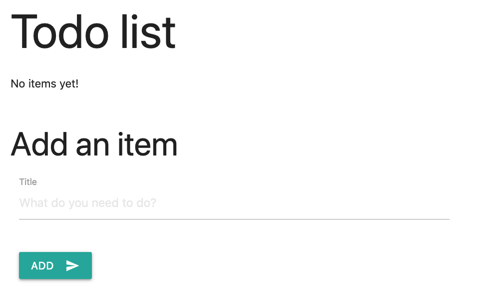

As enterprises have separate teams handling deployment responsibilities, initializing production environment and porting the application is carried out by the infrastructure admin. If you are a developer who handles everything related to deployments, this would be applicable to you as well.

To abstract the infrastructure workflows from the development workflows, we are working on a solution called **Radius recipes** that will enable the infra-admin to prepare connector recipes with all the organizational requirements which can be used by the developers without having to worry about provisioning or managing a resource. Check back for more updates in our future releases

## Initialize Radius environment with Azure cloud provider

In this step, you will initialize a radius production environment. So, you will be adding the Azure cloud provider as you will be swapping the connector resource with Azure cosmos db. 

For simplicity purposes, you can use the same cluster that you used before for setting up the dev environment. 

You can view the current context for kubectl by running
```bash
kubectl config current-context
```

Use the [`rad env init kubernetes` command]() to initialize a new environment into your current kubectl context.
```bash
rad env init kubernetes -i
```

Follow the prompts, 

1. Namespace - This is the namespace where you want the radius application to be deployed in your cluster
{} When Radius initializes a Kubernetes environment, it will install the Radius control plane into your cluster if needed, using the `radius-system` namespace. These control plane resources aren't part your application. The namespace specified in interactive mode will be used for future application deployments by default.
{}

1. Add Azure provider - Add the [Azure cloud provider](). Specify the Azure subscription and resource group where your Azure cosmosdb resource will be deployed

1. Environment name - Lets name the environment as webapp-tutorial-prod-env

Radius installs the control plane, configures Azure cloud provider, creates an environment resource, creates a workspace and updates the configuration to /.rad/config.yaml

### Verify initialization

   To verify the environment initialization succeeded, you can run the following command:

   ```bash
   kubectl get deployments -n radius-system
   ```

   The output should look like this:

   ```bash
   NAME                      READY   UP-TO-DATE   AVAILABLE   AGE
   ucp                       1/1     1            1           53s
   appcore-rp                1/1     1            1           53s
   bicep-de                  1/1     1            1           53s
   contour-contour           1/1     1            1           46s
   dapr-dashboard            1/1     1            1           35s
   dapr-sidecar-injector     1/1     1            1           35s
   dapr-sentry               1/1     1            1           35s
   dapr-operator             1/1     1            1           35s
   ```

## Swap the connector for an Azure resource

The app.bicep from the previous step should look like this 



Update the bicep file like below to swap the connector resource with an Azure cosmosdb resource



## Deploy the application with Azure database

{}
There is a known issue where deployments to Azure will fail with a "NotFound" error for templates containing starters. This is being addressed in an upcoming release. As a workaround submit the deployment a second time. The second deployment should succeed.
{}

1. In a terminal window deploy the app.bicep file :

   ```sh
   rad deploy app.bicep
   ```
   This may take a few minutes to create the database. On completion, you will see the following resources:

   ```sh
   Resources:
      Application              todoapp
      Container                frontend
      HttpRoute                frontend-route
      Gateway                  frontend-gateway
      mongo.com.MongoDatabase  db
   ```

   Just like before, a public endpoint will be available through the gateway.

   ```sh
   Public Endpoints:
    gateway  Gateway            http://20.252.19.39 
   ```

1. To test your application, navigate to the public endpoint that was printed at the end of the deployment. You should see a page like:

   

   If your page matches, then it means that the container is able to communicate with the database. Just like before, you can test the features of the todo app. Add a task or two. Now your data is being stored in an actual database.

## Cleanup

{} If you're done with testing, you can use the rad CLI to [delete an environment]() to prevent additional charges in your Azure subscription. {}
